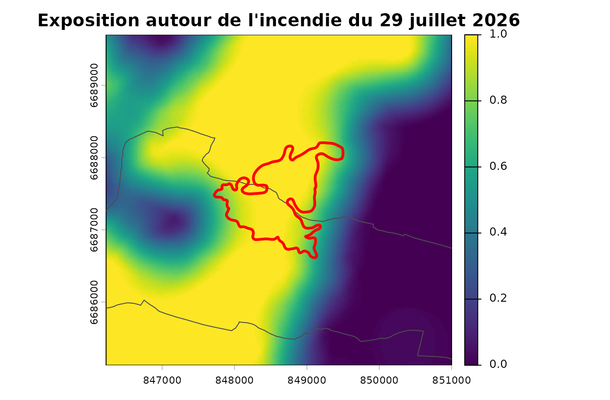

# Couchey : la chaîne sur données réelles, et l'incendie du 29 juillet 2026

``` r

library(firexpovulnR)
library(terra)
library(sf)
```

La vignette
[principale](https://pobsteta.github.io/firexpovulnR/articles/firexpovulnR.md)
déroule la chaîne sur un paysage inventé. Celle-ci la déroule sur des
**données réelles** autour de **Couchey**, en Côte-d’Or — territoire de
référence du projet voisin `nemetonshiny` — et se termine sur un
incendie qui a réellement brûlé la commune le **29 juillet 2026**, six
semaines avant la constitution de cet extrait.

Le terrain n’a pas été choisi pour flatter le package. Couchey est
l’inverse de ce pour quoi il a été conçu : chênaie, hêtraie et charmaie
de plaine bourguignonne, avec des vignes là où un exemple varois aurait
de la garrigue. Plusieurs valeurs par défaut y sont visiblement moins à
leur place, et la vignette le montre.

## Les données

L’extrait est livré avec le package et lu depuis le disque. Il a été
constitué le 2026-08-16 par `data-raw/build_couchey_extract.R`, qui
contacte les services réels ; l’article ne touche pas au réseau, pour la
même raison que les tests : une documentation rouge ne doit pas être un
bulletin de disponibilité de l’IGN.

``` r

gpkg <- system.file("extdata", "couchey.gpkg", package = "firexpovulnR")

commune <- st_read(gpkg, "commune", quiet = TRUE)
study   <- st_read(gpkg, "study_area", quiet = TRUE)
bdforet <- st_read(gpkg, "bdforet_v2", quiet = TRUE)
corine  <- st_read(gpkg, "clc_2018", quiet = TRUE)
feux    <- st_read(gpkg, "burnt_areas", quiet = TRUE)
```

``` r

c(commune = commune$nom, insee = commune$insee,
  km2 = round(as.numeric(st_area(study)) / 1e6, 1),
  bdforet = nrow(bdforet), corine = nrow(corine), feux = nrow(feux))
#>   commune     insee       km2   bdforet    corine      feux 
#> "Couchey"   "21200"   "292.5"     "988"     "176"       "3"
```

Ce qu’on y trouve, en vrai :

``` r

sort(table(bdforet$code_tfv), decreasing = TRUE)[1:6]
#> 
#> FF1-00-00    FF1-00 FF1G01-01      FF31 FF2G53-53      FF32 
#>       213       126       117        99        75        69
sort(table(corine$code_18), decreasing = TRUE)[1:6]
#> 
#> 311 112 211 312 221 321 
#>  27  22  21  18  11  11
```

Aucun pin d’Alep, aucun chêne vert, aucune lande. Du mélange de feuillus
(`FF1-00-00`), du chêne décidu (`FF1G01-01`), du hêtre (`FF1-09-09`) —
et en CORINE, du `221`, c’est-à-dire des **vignes**, sur la Côte.

## Le millésime, et pourquoi il reste ambigu ici

Le package sait retrouver le millésime de la BD Forêt v2 : l’IGN le
définit comme la date de prise de vue de la BD ORTHO sur laquelle elle a
été photo-interprétée. Sur cette emprise, cela donne ceci :

``` r

mil <- st_drop_geometry(st_read(gpkg, "millesime_candidates", quiet = TRUE))
mil[, c("dep", "pva", "date_vol", "year", "pct_area")]
#>   dep  pva   date_vol year pct_area
#> 1  21 2010 2010-07-07 2010     33.8
#> 2  21 2014 2014-07-17 2014     33.9
#> 3  71 2007 2007-01-01 2007     31.0
#> 4  71 2014 2014-07-17 2014      1.3
```

**Trois campagnes distinctes** — 2007, 2010 et 2014 — sur deux
départements, à un tiers de la surface chacune. L’emprise déborde de la
Côte-d’Or sur la Saône-et-Loire, et les deux n’ont pas été survolées la
même année.

C’est le cas d’école de ce que la fonction refuse de trancher : l’IGN ne
publie pas laquelle de ces campagnes a alimenté la production de quel
département, et rien dans la donnée ne le dit. On retient la plus
ancienne, qui est la lecture prudente — celle qui maximisera l’écart
rapporté à la fin.

``` r

millesime_prudent <- min(mil$year)
millesime_prudent
#> [1] 2007
```

## Combustible

``` r

primaire <- fev_fuel_source(bdforet, type = "bdforet_v2", res = 25,
                            aoi = study, millesime = millesime_prudent)
auxiliaire <- fev_fuel_source(corine, type = "clc_2018", res = 25,
                              aoi = study, millesime = 2018)
fuel <- fev_fuel_merge(primaire, auxiliaire)
#> "clc_2018" filled 278830 cells (59.3%) that
#> "bdforet_v2" left unmapped.
```

La couche de provenance par pixel dit ce que chaque source apporte :

``` r

src <- fev_fuel_categorical(fuel)[["source"]]
lv <- terra::levels(src)[[1]]
tab <- table(lv$class[match(terra::values(src)[, 1], lv$id)])
round(100 * tab / sum(tab), 1)
#> 
#> bdforet_v2   clc_2018 
#>       40.7       59.3
```

### Où les défauts du package sont mal à l’aise

``` r

ft <- fev_fuel_type(fuel)
freq <- terra::freq(fev_data(ft))
head(freq[order(-freq$count), c("value", "count")], 5)
#>               value  count
#> 5          cropland 190865
#> 1  broadleaf_closed 148556
#> 10         non_fuel  68296
#> 3    conifer_closed  23655
#> 7      mixed_closed  16721
```

Le peuplement dominant est du feuillu fermé, auquel
[`fev_fuel_weights()`](https://pobsteta.github.io/firexpovulnR/reference/fev_fuel_weights.md)
attribue **0,60** — contre 0,95 pour le conifère fermé et 1,00 pour le
maquis. Ces poids sont une convention du package, pas une mesure, et ils
ont été ordonnés en pensant au pourtour méditerranéen. Sur une chênaie
bourguignonne ils disent surtout « moins inflammable que du pin d’Alep
», ce qui est vrai et peu informatif — et l’incendie de la section 7
rappellera que « moins » n’est pas « pas ».

Et les vignes, classées non brûlables :

``` r

clc_lookup <- fev_fuel_lookup("clc")
clc_lookup[clc_lookup$code == "221", c("code", "label", "burnable", "confidence")]
#>    code     label burnable confidence
#> 15  221 Vineyards    FALSE  ambiguous
```

L’une des sept lignes agricoles marquées `ambiguous`. Sur la Côte, une
vigne travaillée est effectivement un pare-feu ; l’hypothèse tient. Elle
tiendrait moins bien sur des terrasses abandonnées.

``` r

brulable <- fev_fuel_binary(fuel)
par(mar = c(2, 2, 2, 4))
plot(fev_data(brulable), main = "Combustible brûlable")
plot(st_geometry(commune), add = TRUE, border = "white", lwd = 2)
plot(st_geometry(feux), add = TRUE, border = "red", lwd = 2)
```


Trait blanc, la commune. Traits rouges, les trois incendies.

## Exposition

``` r

expo <- fev_exposure(brulable, radius = 500, type = "ember", quiet = TRUE)
terra::global(fev_data(expo), c("mean", "max"), na.rm = TRUE)
#>               mean max
#> exposure 0.4623234   1
```

Le rayon de 500 m vient de travaux albertains, validés depuis au
Portugal. Sur une mosaïque bourguignonne de bois, cultures et vignes, il
n’est validé nulle part.

## Danger météorologique — le seul ingrédient inventé

Le produit historique CEMS demande un jeton Copernicus personnel, que le
package s’interdit de manipuler. La série ci-dessous est donc
**synthétique**, et c’est la seule chose de cette page qui ne soit pas
une donnée réelle.

``` r

meteo <- rast(nrows = 6, ncols = 4, extent = ext(vect(study)),
              crs = "EPSG:2154", nlyr = 730)
values(meteo) <- matrix(abs(rnorm(24 * 730, mean = 9, sd = 7)), nrow = 24)
time(meteo) <- seq(as.Date("2019-01-01"), by = "day", length.out = 730)
```

``` r

danger_pct <- fev_fwi_percentile(meteo, ref_period = c(2019, 2020))
```

Sur un FWI bourguignon, les seuils absolus EFFIS placeraient presque
tout en classe basse toute l’année. C’est exactement ce que la
calibration en percentiles corrige : un 98e percentile veut dire «
journée exceptionnelle **ici** ».

## Alignement, vulnérabilité, risque

``` r

dernier <- fev_data(danger_pct)[[terra::nlyr(fev_data(danger_pct))]]
dispo <- fev_fuel_availability(fuel, weights = fev_fuel_weights(quiet = TRUE))
pile <- fev_align(danger = dernier, disponibilite = fev_data(dispo),
                  exposition = fev_data(expo))
#> Warning: Aligning layers whose cell sizes differ by a factor of 126.4.
#> ℹ Finest "disponibilite" at 25; coarsest "danger" at 3160.2.
#> ℹ Target grid: 25 (finest).
#> ℹ Each coarse cell is copied across about 16000 fine cells. That adds
#>   resolution, not information.
#> ℹ The ratio is recorded in the provenance.
```

``` r

bati <- terra::rasterize(vect(commune), pile$exposition, field = 1,
                         background = 0)
vuln <- fev_vuln_stack(
  humaine = fev_vuln_layer(bati, method = "minmax", name = "commune"),
  forestiere = fev_vuln_layer(pile$exposition, method = "percentile_rank",
                              name = "expo"),
  weights = c(0.5, 0.5)
)
#> Warning: "minmax" normalisation rescales on this extent's own range.
#> ℹ Observed range 0 and 1. The same cell scores differently under a different
#>   AOI, so vulnerability layers are not comparable between study areas.
#> ℹ Shown once per session; recorded in the provenance every time.
```

``` r

danger <- fev_danger_index(pile$danger, pile$disponibilite,
                           normalise = "percentile")
risque <- fev_risk(danger, vuln, normalise = "none")
```

``` r

par(mar = c(2, 2, 2, 4))
plot(fev_data(risque), main = "Risque composite (effis_mean)")
plot(st_geometry(commune), add = TRUE, border = "white", lwd = 2)
plot(st_geometry(feux), add = TRUE, border = "red", lwd = 2)
```


## L’incendie du 29 juillet 2026

``` r

st_drop_geometry(feux)[, c("fire_date", "area_ha", "COMMUNE", "CLASS")]
#>    fire_date area_ha             COMMUNE      CLASS
#> 1 2020-07-31      26    Velars-sur-Ouche FireSeason
#> 2 2026-07-08      41 Nuits-Saint-Georges FireSeason
#> 3 2026-07-29     124             Couchey     30DAYS
```

Trois incendies, tous ceux que l’endpoint public EFFIS sert dans un
rayon de 20 km. Le troisième a brûlé **Couchey même**.

``` r

couchey <- feux[feux$COMMUNE == "Couchey", ]
st_drop_geometry(couchey)[, c("FIREDATE", "FINALDATE", "area_ha", "PERCNA2K",
                              "BROADLEA", "MIXED", "OTHERNATLC")]
#>              FIREDATE           FINALDATE area_ha          PERCNA2K
#> 3 2026-07-29 13:42:00 2026-07-30 02:15:00     124 99.99999999999997
#>            BROADLEA              MIXED         OTHERNATLC
#> 3 60.48387096769316 16.935483870954084 22.580645161272113
```

**124 hectares**, déclaré le 29 juillet 2026 à 13 h 42, éteint le
lendemain à 2 h 15 — un peu plus de douze heures. `PERCNA2K = 100` : la
totalité de la surface brûlée est en site Natura 2000. Et l’occupation
du sol brûlée, telle qu’EFFIS la ventile, est à 60 % de feuillus et 17 %
de forêt mixte.

C’est-à-dire exactement le combustible que les poids par défaut du
package classent en bas de leur échelle.

``` r

zone <- st_buffer(st_geometry(couchey), 1500)
par(mar = c(2, 2, 2, 4))
plot(terra::crop(fev_data(expo), vect(zone)),
     main = "Exposition autour de l'incendie du 29 juillet 2026")
plot(st_geometry(commune), add = TRUE, border = "grey30", lwd = 1)
plot(st_geometry(couchey), add = TRUE, border = "red", lwd = 3)
```



## Validation — et la conclusion honnête

``` r

val <- fev_validate(risque, feux, millesime = millesime_prudent)
val$temporal$table
#>                        lag_years n_fires area_ha pct_area
#> 1 <= 0 (fire before the vintage)       0       0        0
#> 2                         1 to 5       0       0        0
#> 3                            > 5       3     191      100
```

**Cent pour cent de la surface brûlée postdate le millésime de plus de
cinq ans.** Pas une partie : la totalité. L’incendie de Couchey a brûlé
**dix-neuf ans** après la prise de vue la plus ancienne de l’emprise,
douze ans après la plus récente. Entre les deux, le peuplement a poussé,
a été coupé, s’est refermé — la couche de combustible sous cette carte
décrit un paysage d’une autre époque.

``` r

data.frame(commune = feux$COMMUNE, annee = feux$fire_year,
           ecart_2007 = feux$fire_year - 2007,
           ecart_2014 = feux$fire_year - 2014)
#>               commune annee ecart_2007 ecart_2014
#> 1    Velars-sur-Ouche  2020         13          6
#> 2 Nuits-Saint-Georges  2026         19         12
#> 3             Couchey  2026         19         12
```

Le filtrage à cinq ans ne laisse donc rien :

``` r

fev_validate(risque, feux, millesime = millesime_prudent, max_lag_years = 5)
#> Warning: 100% of the burnt area in this sample postdates the fuel vintage (2007) by more
#> than 5 years.
#> ℹ 3 of 3 fires. Those burnt a landscape the fuel layer does not describe.
#> ℹ They are dropped, on your `max_lag_years`.
#> Error in `fev_validate()`:
#> ! No fire is left after the temporal filter.
#> ℹ `max_lag_years` = 5 against a vintage of 2007 removed all 3 of them.
#> ℹ Either the fuel data long predates the fire record, or the vintage is wrong.
```

C’est le résultat, et il est bon qu’il ressemble à un échec. La
conclusion n’est pas « la carte a un AUC de tant » — c’est **cette carte
ne peut pas être validée avec cette donnée** :

- trois incendies ne valident rien, quel que soit l’AUC calculé dessus ;
- ils ont tous brûlé plus de six ans après la photographie aérienne qui
  fonde la couche de combustible, et celui de Couchey dix-neuf ans après
  ;
- et l’ambiguïté 2007 / 2010 / 2014 fait varier cet écart de sept ans
  sans qu’on puisse la lever.

``` r

val$auc
#> [1] 0.8291124
val$classes[, c("class", "pct_of_area", "pct_of_burnt", "ratio")]
#>       class pct_of_area pct_of_burnt ratio
#> 1   0 - 0.2       58.59        24.96  0.43
#> 2 0.2 - 0.4       27.89        13.04  0.47
#> 3 0.4 - 0.6        9.94        18.42  1.85
#> 4 0.6 - 0.8        3.32        29.07  8.76
#> 5   0.8 - 1        0.26        14.50 55.87
```

Le chiffre existe, il est dans l’objet, et il n’a pas de valeur probante
ici. Il est montré pour que ce soit dit explicitement plutôt que par
omission — un package qui rendrait un AUC sans rien ajouter serait plus
agréable et moins utile.

## Ce que cet exemple apprend

| Ce qui tient | Ce qui tient moins |
|----|----|
| La chaîne, les grilles, la provenance | Les poids de disponibilité, ordonnés pour le méditerranéen |
| La récupération du millésime | Son ambiguïté, ici entre trois campagnes |
| La calibration en percentiles | Les seuils FWI absolus, peu discriminants en Bourgogne |
| Le contrôle de biais temporel, qui fait son travail | Le rayon de 500 m, validé ni ici ni ailleurs sur ce combustible |
| Les vignes non brûlables, sur la Côte | La même hypothèse sur des terrasses abandonnées |

Et deux limites que ni le terrain ni le package ne lèvent.

Le **sous-étage** : ni CORINE ni la BD Forêt ne le décrivent. Une
chênaie de Couchey avec un taillis de charme dense et la même sans sont
identiques dans la base, et la propagation de surface en dépend
directement. Cent vingt-quatre hectares en douze heures dans du feuillu,
fin juillet, disent quelque chose que la couche de combustible ne
contient pas.

Le **millésime** : il est désormais récupérable, mais pas
désambiguïsable, et il a ici dix-neuf ans de retard sur l’événement
qu’on voudrait expliquer. Un inventaire forestier n’est pas une
observation en temps réel, et une carte de risque bâtie dessus hérite de
son âge.
