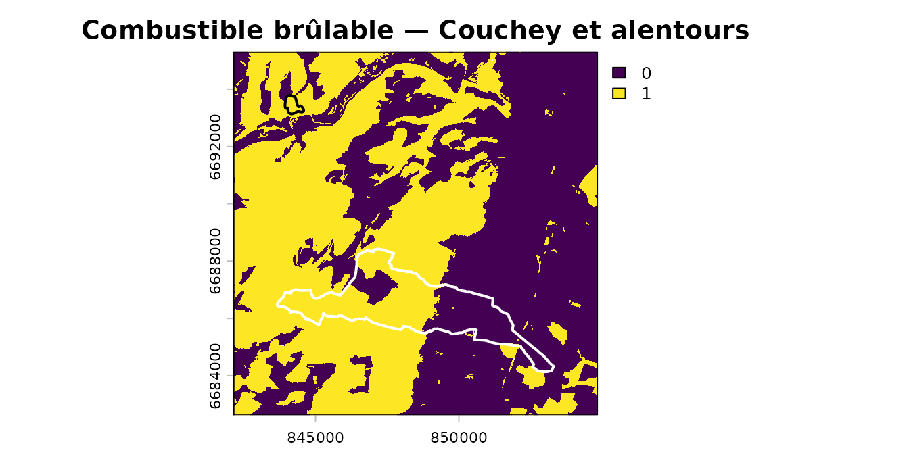
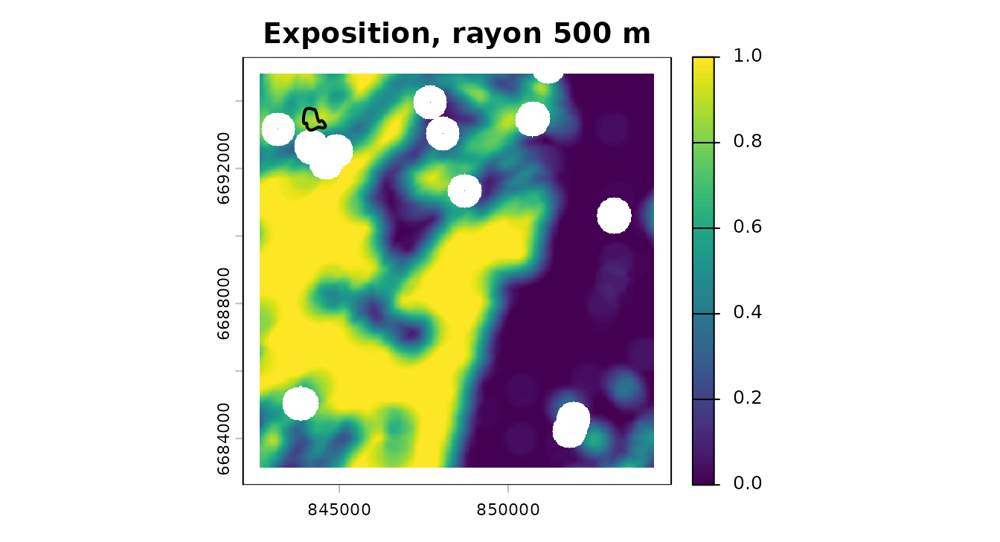
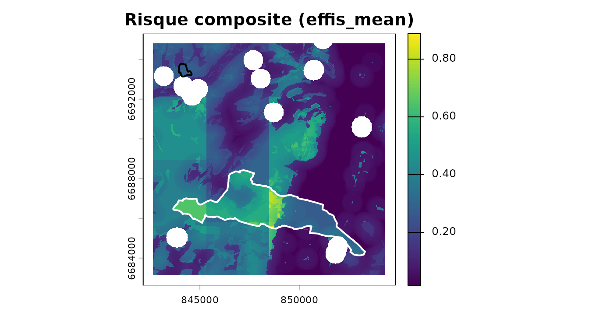

# Couchey : la chaîne sur données réelles, hors de son terrain de conception

``` r

library(firexpovulnR)
library(terra)
library(sf)
```

La vignette
[principale](https://pobsteta.github.io/firexpovulnR/articles/firexpovulnR.md)
déroule la chaîne sur un paysage inventé. Celle-ci la déroule sur des
**données réelles** — BD Forêt v2, CORINE et surfaces brûlées EFFIS —
autour de **Couchey**, en Côte-d’Or, qui est le territoire de référence
du projet voisin `nemetonshiny`.

Le choix n’est pas neutre, et c’est l’intérêt. Couchey est l’inverse du
terrain pour lequel ce package a été conçu : chênaie, hêtraie et
charmaie de plaine bourguignonne, avec des vignes là où un exemple
varois aurait de la garrigue. Plusieurs valeurs par défaut y sont
visiblement moins à leur place, et la vignette le montre plutôt que de
choisir un terrain complaisant.

## Les données

L’extrait est livré avec le package et lu depuis le disque. Il a été
constitué le 2026-08-16 par `data-raw/build_couchey_extract.R`, qui
contacte les services réels ; l’article, lui, ne touche pas au réseau,
pour la même raison que les tests : une documentation rouge ne doit pas
être un bulletin de disponibilité de l’IGN.

``` r

gpkg <- system.file("extdata", "couchey.gpkg", package = "firexpovulnR")
st_layers(gpkg)$name
#> [1] "commune"              "study_area"           "bdforet_v2"          
#> [4] "clc_2018"             "burnt_areas"          "millesime_candidates"

commune <- st_read(gpkg, "commune", quiet = TRUE)
study   <- st_read(gpkg, "study_area", quiet = TRUE)
bdforet <- st_read(gpkg, "bdforet_v2", quiet = TRUE)
corine  <- st_read(gpkg, "clc_2018", quiet = TRUE)
feux    <- st_read(gpkg, "burnt_areas", quiet = TRUE)
```

``` r

commune[, c("nom", "insee")]
#> Simple feature collection with 1 feature and 2 fields
#> Geometry type: MULTIPOLYGON
#> Dimension:     XY
#> Bounding box:  xmin: 843661.7 ymin: 6684136 xmax: 853302.7 ymax: 6688423
#> Projected CRS: RGF93 v1 / Lambert-93
#>       nom insee                           geom
#> 1 Couchey 21200 MULTIPOLYGON (((852938.9 66...
round(as.numeric(st_area(study)) / 1e6, 1)   # km2
#> [1] 159.8
```

Ce qu’on y trouve, en vrai :

``` r

sort(table(bdforet$code_tfv), decreasing = TRUE)[1:6]
#> 
#> FF1-00-00    FF1-00      FF31 FF1G01-01 FF2G53-53       FO1 
#>       123        74        62        52        50        46
sort(table(corine$code_18), decreasing = TRUE)[1:6]
#> 
#> 211 311 312 112 321 121 
#>  13  13  13  10   8   6
```

Aucun pin d’Alep, aucun chêne vert, aucune lande. Du mélange de feuillus
(`FF1-00-00`), du chêne décidu (`FF1G01-01`), du hêtre (`FF1-09-09`) —
et en CORINE, du `221`, c’est-à-dire des **vignes**, sur la Côte.

## Le millésime, et pourquoi il reste ambigu ici

Le package sait maintenant retrouver le millésime de la BD Forêt v2 :
l’IGN le définit comme la date de prise de vue de la BD ORTHO sur
laquelle elle a été photo-interprétée. Sur Couchey, cela donne ceci :

``` r

mil <- st_drop_geometry(st_read(gpkg, "millesime_candidates", quiet = TRUE))
mil[, c("dep", "pva", "date_vol", "year", "pct_area")]
#>   dep  pva   date_vol year pct_area
#> 1  21 2010 2010-07-07 2010     49.9
#> 2  21 2014 2014-07-17 2014     50.1
```

Deux campagnes, **2010 et 2014**, à cinquante-cinquante de la surface.
C’est le cas d’école de ce que la fonction refuse de trancher : l’IGN ne
publie pas laquelle a alimenté la production de la Côte-d’Or, et rien
dans la donnée ne le dit. On garde les deux en tête — la section
validation y revient, parce que l’écart entre les deux change la
conclusion.

``` r

millesime_prudent <- min(mil$year)   # ce que fait strategy = "oldest"
millesime_prudent
#> [1] 2010
```

## Combustible

``` r

primaire <- fev_fuel_source(bdforet, type = "bdforet_v2", res = 25,
                            aoi = study, millesime = millesime_prudent)
auxiliaire <- fev_fuel_source(corine, type = "clc_2018", res = 25,
                              aoi = study, millesime = 2018)
fuel <- fev_fuel_merge(primaire, auxiliaire)
#> "clc_2018" filled 145098 cells (56.4%) that
#> "bdforet_v2" left unmapped.
fuel
#> 
#> ── fev_fuel_source: bdforet_v2+clc_2018 ────────────────────────────────────────
#> • Millesime: bdforet_v2 2010, clc_2018 2018
#> • Registers: "categorical"
#> • Categorical: 507 x 507 cells at 25 EPSG:2154, 41 classes
#> • Per-pixel source: "bdforet_v2" and "clc_2018"
#> • Lookup: 76 rows, 21 flagged ambiguous
#> 
#> Provenance: 2 sources, 3 steps.
```

La couche de provenance par pixel dit ce que chaque source apporte :

``` r

src <- fev_fuel_categorical(fuel)[["source"]]
lv <- terra::levels(src)[[1]]
tab <- table(lv$class[match(terra::values(src)[, 1], lv$id)])
round(100 * tab / sum(tab), 1)
#> 
#> bdforet_v2   clc_2018 
#>       43.5       56.5
```

``` r

head(summary(fuel)$classes, 8)
#>        class cells   pct        fuel_type burnable
#> 28       211 59255 23.05         cropland    FALSE
#> 3  FF1-00-00 44629 17.36 broadleaf_closed     TRUE
#> 22       112 36328 14.13         non_fuel    FALSE
#> 6  FF1G01-01 21009  8.17 broadleaf_closed     TRUE
#> 23       121 12419  4.83         non_fuel    FALSE
#> 29       221 11938  4.64         cropland    FALSE
#> 4  FF1-09-09 11281  4.39 broadleaf_closed     TRUE
#> 12 FF2G53-53 10968  4.27   conifer_closed     TRUE
```

### Où les défauts du package sont mal à l’aise

``` r

ft <- fev_fuel_type(fuel)
freq <- terra::freq(fev_data(ft))
freq[order(-freq$count), c("value", "count")]
#>                  value count
#> 1     broadleaf_closed 82751
#> 5             cropland 79437
#> 10            non_fuel 55534
#> 3       conifer_closed 14603
#> 7         mixed_closed  9982
#> 2       broadleaf_open  4149
#> 6            grassland  2942
#> 15    urban_vegetation  2405
#> 8           mixed_open  2137
#> 12           shrubland  1103
#> 14           unstocked   685
#> 4         conifer_open   553
#> 13  transitional_shrub   333
#> 9  mosaic_agri_natural   213
#> 11   poplar_plantation   199
```

Le peuplement dominant est du feuillu fermé, auquel
[`fev_fuel_weights()`](https://pobsteta.github.io/firexpovulnR/reference/fev_fuel_weights.md)
attribue **0,60** — contre 0,95 pour le conifère fermé et 1,00 pour le
maquis. Ces poids sont une convention du package, pas une mesure, et ils
ont été ordonnés en pensant au pourtour méditerranéen. Sur une chênaie
bourguignonne ils disent surtout « moins inflammable que du pin d’Alep
», ce qui est vrai et peu informatif.

Et les vignes, classées non brûlables :

``` r

clc_lookup <- fev_fuel_lookup("clc")
clc_lookup[clc_lookup$code == "221", c("code", "label", "burnable", "confidence")]
#>    code     label burnable confidence
#> 15  221 Vineyards    FALSE  ambiguous
```

C’est l’une des sept lignes agricoles marquées `ambiguous`. Sur la Côte,
une vigne travaillée est effectivement un pare-feu ; l’hypothèse tient.
Elle tiendrait moins bien sur des terrasses abandonnées.

``` r

brulable <- fev_fuel_binary(fuel)
par(mar = c(2, 2, 2, 4))
plot(fev_data(brulable), main = "Combustible brûlable — Couchey et alentours")
plot(st_geometry(commune), add = TRUE, border = "white", lwd = 2)
plot(st_geometry(feux), add = TRUE, border = "black", lwd = 2)
```



Le trait blanc est la commune, le trait noir l’incendie de 2020.

## Exposition

``` r

expo <- fev_exposure(brulable, radius = 500, type = "ember", quiet = TRUE)
terra::global(fev_data(expo), c("mean", "max"), na.rm = TRUE)
#>               mean max
#> exposure 0.4875536   1
```

``` r

par(mar = c(2, 2, 2, 4))
plot(fev_data(expo), main = "Exposition, rayon 500 m")
plot(st_geometry(feux), add = TRUE, border = "black", lwd = 2)
```



Le rayon de 500 m vient de travaux albertains, validés depuis au
Portugal. Sur une mosaïque bourguignonne de bois, cultures et vignes, il
n’est validé nulle part — moins encore qu’en Provence, où au moins le
type de combustible se rapproche de l’ibérique.

## Danger météorologique — le seul ingrédient inventé

Le produit historique CEMS demande un jeton Copernicus personnel, que le
package s’interdit de manipuler. La série ci-dessous est donc
**synthétique**, et c’est la seule chose de cette page qui ne soit pas
une donnée réelle.

``` r

meteo <- rast(nrows = 4, ncols = 4, extent = ext(vect(study)),
              crs = "EPSG:2154", nlyr = 730)
values(meteo) <- matrix(abs(rnorm(16 * 730, mean = 9, sd = 7)), nrow = 16)
time(meteo) <- seq(as.Date("2019-01-01"), by = "day", length.out = 730)
```

``` r

danger_pct <- fev_fwi_percentile(meteo, ref_period = c(2019, 2020))
```

Une remarque qui n’est pas de décor : sur un FWI bourguignon, les seuils
absolus EFFIS placeraient presque tout en classe basse toute l’année.
C’est exactement ce que la calibration en percentiles corrige — un 98e
percentile veut dire « journée exceptionnelle **ici** », que l’ici soit
la Côte ou les Maures.

## Alignement, vulnérabilité, risque

``` r

dernier <- fev_data(danger_pct)[[terra::nlyr(fev_data(danger_pct))]]
dispo <- fev_fuel_availability(fuel, weights = fev_fuel_weights(quiet = TRUE))
pile <- fev_align(danger = dernier, disponibilite = fev_data(dispo),
                  exposition = fev_data(expo))
#> Warning: Aligning layers whose cell sizes differ by a factor of 126.4.
#> ℹ Finest "disponibilite" at 25; coarsest "danger" at 3160.2.
#> ℹ Target grid: 25 (finest).
#> ℹ Each coarse cell is copied across about 16000 fine cells. That adds
#>   resolution, not information.
#> ℹ The ratio is recorded in the provenance.
```

Le rapport d’échelle est ici modeste — la grille météo synthétique est
grossière mais pas kilométrique — et il part quand même dans la
provenance.

``` r

batî <- rast(pile$exposition)
values(batî) <- 0
batî <- terra::rasterize(vect(commune), batî, field = 1, background = 0)

vuln <- fev_vuln_stack(
  humaine = fev_vuln_layer(batî, method = "minmax", name = "commune"),
  forestiere = fev_vuln_layer(pile$exposition, method = "percentile_rank",
                              name = "expo"),
  weights = c(0.5, 0.5)
)
#> Warning: "minmax" normalisation rescales on this extent's own range.
#> ℹ Observed range 0 and 1. The same cell scores differently under a different
#>   AOI, so vulnerability layers are not comparable between study areas.
#> ℹ Shown once per session; recorded in the provenance every time.
```

``` r

danger <- fev_danger_index(pile$danger, pile$disponibilite,
                           normalise = "percentile")
risque <- fev_risk(danger, vuln, normalise = "none")
```

``` r

par(mar = c(2, 2, 2, 4))
plot(fev_data(risque), main = "Risque composite (effis_mean)")
plot(st_geometry(commune), add = TRUE, border = "white", lwd = 2)
plot(st_geometry(feux), add = TRUE, border = "black", lwd = 2)
```



## Validation — et la conclusion honnête

``` r

st_drop_geometry(feux)[, c("fire_date", "fire_year", "area_ha")]
#>    fire_date fire_year area_ha
#> 1 2020-07-31      2020      26
```

**Un seul incendie.** EFFIS ne cartographie que les feux d’une trentaine
d’hectares et plus, et la Bourgogne en produit peu : sur 160 km² et neuf
années, l’endpoint public en sert un, de 26 ha, le 31 juillet 2020.

``` r

val <- fev_validate(risque, feux, millesime = millesime_prudent)
val$temporal$table
#>                        lag_years n_fires area_ha pct_area
#> 1 <= 0 (fire before the vintage)       0       0        0
#> 2                         1 to 5       0       0        0
#> 3                            > 5       1      26      100
```

Le feu de 2020 postdate le millésime prudent de **dix ans**. Avec
l’autre candidat, 2014, il le postdate encore de six. Dans les deux cas,
l’écart dépasse le seuil par défaut de cinq ans, et le filtrage ne
laisse rien :

``` r

fev_validate(risque, feux, millesime = millesime_prudent, max_lag_years = 5)
#> Warning: 100% of the burnt area in this sample postdates the fuel vintage (2010) by more
#> than 5 years.
#> ℹ 1 of 1 fire. Those burnt a landscape the fuel layer does not describe.
#> ℹ They are dropped, on your `max_lag_years`.
#> Error in `fev_validate()`:
#> ! No fire is left after the temporal filter.
#> ℹ `max_lag_years` = 5 against a vintage of 2010 removed all 1 of them.
#> ℹ Either the fuel data long predates the fire record, or the vintage is wrong.
```

C’est le résultat, et il est bon qu’il ressemble à un échec. La
conclusion n’est pas « la carte a un AUC de tant » — c’est **cette carte
ne peut pas être validée avec cette donnée** :

- un seul feu ne valide rien, quel que soit l’AUC calculé dessus ;
- il a brûlé dix ans après la photographie aérienne sur laquelle repose
  la couche de combustible, dans un paysage que celle-ci ne décrit plus
  ;
- et l’ambiguïté 2010/2014 fait varier cet écart de quatre ans sans
  qu’on puisse la lever.

Un package qui rendrait ici un AUC de 0,73 sans rien dire d’autre serait
plus agréable et moins utile.

``` r

val$auc
#> [1] 0.5827183
val$classes[, c("class", "pct_of_area", "pct_of_burnt", "ratio")]
#>       class pct_of_area pct_of_burnt ratio
#> 1   0 - 0.2       49.15         1.98  0.04
#> 2 0.2 - 0.4       31.41        98.02  3.12
#> 3 0.4 - 0.6       17.25         0.00  0.00
#> 4 0.6 - 0.8        2.10         0.00  0.00
#> 5   0.8 - 1        0.10         0.00  0.00
```

Le chiffre existe, il est dans l’objet, et il n’a pas de valeur probante
ici. Il est montré pour que ce soit dit explicitement plutôt que par
omission.

## Ce que cet exemple apprend

Le package tourne de bout en bout sur un territoire pour lequel il n’a
pas été conçu, sans rien casser — et c’est précisément parce qu’il ne
cache pas ses hypothèses qu’on peut voir lesquelles ne tiennent plus :

| Ce qui tient | Ce qui tient moins |
|----|----|
| La chaîne, les grilles, la provenance | Les poids de disponibilité, ordonnés pour le méditerranéen |
| La récupération du millésime | Son ambiguïté, ici à 50/50 entre deux campagnes |
| La calibration en percentiles, qui rend le FWI comparable | Les seuils FWI absolus, peu discriminants en Bourgogne |
| Le contrôle de biais temporel, qui fait son travail | Le rayon de 500 m, validé ni ici ni ailleurs sur ce combustible |
| Les vignes non brûlables, hypothèse raisonnable sur la Côte | La même hypothèse sur des terrasses abandonnées |

Et une limite que ni le terrain ni le package ne peuvent lever : ni
CORINE ni la BD Forêt ne décrivent le sous-étage. Une chênaie de Couchey
avec un taillis de charme dense et la même sans sont identiques dans la
base, et la propagation de surface en dépend directement.
