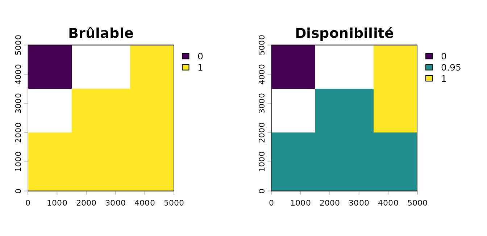
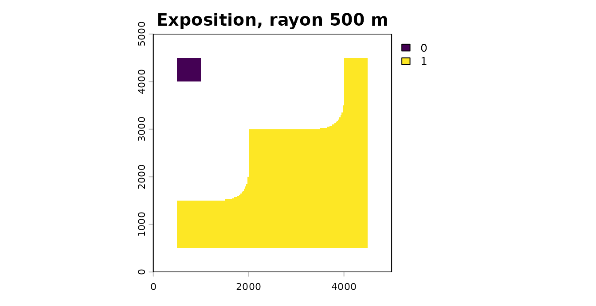
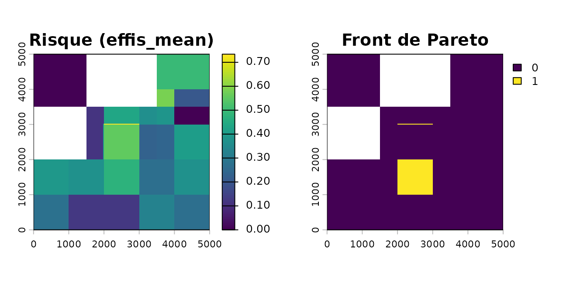
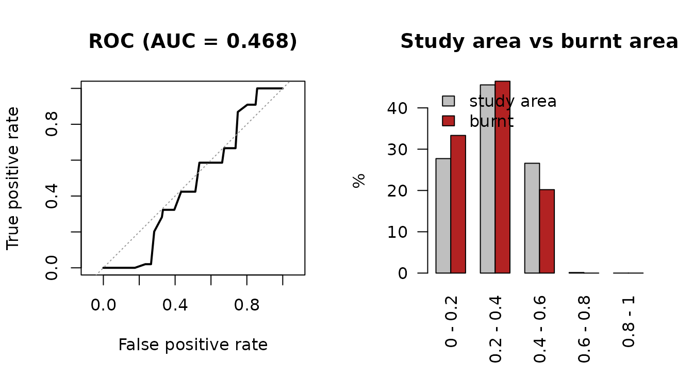

# Chaîne complète : du combustible au risque validé

``` r

library(firexpovulnR)
library(terra)
library(sf)
```

Cette vignette déroule la chaîne complète, du combustible au risque
validé, **sans réseau**. Les sources réelles sont montrées à leur place,
dans des blocs non exécutés ; le paysage utilisé ici est synthétique,
pour que la vignette soit rejouable partout et rapide à construire.

Elle sert aussi à dire, à chaque étape, ce qui est sourcé et ce qui ne
l’est pas. Le package impose une seule chose : que ce partage soit
lisible.

## 1. Le paysage d’étude

On fabrique un massif de 5 km de côté : une pinède au sud, une chênaie
verte au centre, du maquis à l’est, de l’eau au nord-ouest.

``` r

rect <- function(x1, x2, y1, y2) {
  st_polygon(list(cbind(c(x1, x2, x2, x1, x1), c(y1, y1, y2, y2, y1))))
}

bdforet <- st_sf(
  code_tfv = c("FF2-57-57", "FF1G06-06"),   # pin d'Alep, chêne vert
  geometry = st_sfc(rect(0, 5000, 0, 2000), rect(1500, 3500, 2000, 3500),
                    crs = 2154)
)

corine <- st_sf(
  code_18 = c("323", "512"),                 # sclérophylles, plans d'eau
  geometry = st_sfc(rect(3500, 5000, 2000, 5000), rect(0, 1500, 3500, 5000),
                    crs = 2154)
)

aoi <- st_as_sf(st_sfc(rect(0, 5000, 0, 5000), crs = 2154))
```

En production, ces deux couches viennent des services :

``` r

bdforet <- fev_data(fev_fetch_bdforet(aoi, millesime = 2014, dept = "83"))
corine  <- fev_data(fev_fetch_corine(aoi, year = 2018))
```

## 2. Combustible

[`fev_fuel_source()`](https://pobsteta.github.io/firexpovulnR/reference/fev_fuel_source.md)
rasterise sur une grille calée, à une résolution qui est un paramètre
explicite. Le millésime de la BD Forêt est **obligatoire** : sans lui,
le contrôle de biais temporel de la section 7 ne peut pas tourner.

``` r

primaire <- fev_fuel_source(bdforet, type = "bdforet_v2", res = 25,
                            aoi = aoi, millesime = 2014)
auxiliaire <- fev_fuel_source(corine, type = "clc_2018", res = 25,
                              aoi = aoi, millesime = 2018)

fuel <- fev_fuel_merge(primaire, auxiliaire)
#> "clc_2018" filled 10800 cells (27%) that
#> "bdforet_v2" left unmapped.
fuel
#> 
#> ── fev_fuel_source: bdforet_v2+clc_2018 ────────────────────────────────────────
#> • Millesime: bdforet_v2 2014, clc_2018 2018
#> • Registers: "categorical"
#> • Categorical: 200 x 200 cells at 25 EPSG:2154, 4 classes
#> • Per-pixel source: "bdforet_v2" and "clc_2018"
#> • Lookup: 76 rows, 21 flagged ambiguous
#> 
#> Provenance: 2 sources, 3 steps.
```

La fusion est hiérarchique et laisse une trace : la couche `source` dit,
pour chaque pixel, de quel jeu de données vient sa classe. Sans elle, un
pixel de 25 m issu de la BD Forêt et un pixel rééchantillonné depuis une
unité CORINE de 25 ha se ressemblent et ne veulent pas dire la même
chose.

``` r

summary(fuel)
#> 
#> ── fev_fuel_source summary: bdforet_v2+clc_2018 ────────────────────────────────
#>      class cells   pct          fuel_type burnable
#>  FF2-57-57 16000 50.63     conifer_closed     TRUE
#>        323  7200 22.78          shrubland     TRUE
#>  FF1G06-06  4800 15.19 sclerophyll_closed     TRUE
#>        512  3600 11.39           non_fuel    FALSE
```

Les tables de correspondance sont justifiées ligne par ligne, et 4 des
32 lignes de la BD Forêt comme 17 des 44 de CORINE sont marquées
ambiguës :

``` r

clc <- fev_fuel_lookup("clc")
head(clc[clc$confidence == "ambiguous", c("code", "label", "notes")], 3)
#>    code                      label
#> 2   112 Discontinuous urban fabric
#> 6   124                   Airports
#> 10  141          Green urban areas
#>                                                                                                                                                                                                                                                                                          notes
#> 2  The wildland-urban interface itself. Gardens, hedges and unmanaged plots inside it do carry fire, and this is where exposure assessment matters most -- but the class records buildings, not fuel. Treated as non-fuel here and as an ASSET in fev_vuln_layer(), which is the honest split.
#> 6                                                                                                                                                                                       Runways are non-fuel but airport grassland can be extensive. Below the mapping unit, so not separable.
#> 10                                                                                                                                 Parks and cemeteries: real vegetation, but irrigated, fragmented and managed. Burnable TRUE, with a low availability weight, rather than excluded outright.
```

De là viennent le masque brûlable et la disponibilité pondérée. **Les
poids ne sont sourcés nulle part** : ce sont une convention du package,
et la fonction le dit à chaque appel.

``` r

brulable <- fev_fuel_binary(fuel)
poids <- fev_fuel_weights(quiet = TRUE)   # quiet ici seulement : voir ?fev_fuel_weights
dispo <- fev_fuel_availability(fuel, weights = poids)
```

``` r

par(mfrow = c(1, 2), mar = c(2, 2, 2, 4))
plot(fev_data(brulable), main = "Brûlable")
plot(fev_data(dispo), main = "Disponibilité")
```



## 3. Exposition

L’anneau focal reproduit la géométrie de
[`fireexposuR::fire_exp()`](https://docs.ropensci.org/fireexposuR/reference/fire_exp.html),
cellule évaluée exclue. Les rayons viennent de travaux canadiens ; la
métrique a été validée au Portugal, le rayon ne l’est pas sur chêne vert
ou maquis.

``` r

expo <- fev_exposure(brulable, radius = 500, type = "ember", quiet = TRUE)
expo
#> 
#> ── fev_exposure_layer: exposure ────────────────────────────────────────────────
#> • 200 x 200 cells at 25, EPSG:2154
#> • Units: "proportion of surrounding fuel, 0-1"
#> • Range: 0 and 1
#> • Mapped: 35.5% of cells
```

``` r

par(mar = c(2, 2, 2, 4))
plot(fev_data(expo), main = "Exposition, rayon 500 m")
```



Depuis un enjeu ponctuel,
[`fev_directional()`](https://pobsteta.github.io/firexpovulnR/reference/fev_directional.md)
répond à une autre question : d’où un feu pourrait-il arriver.

``` r

maison <- c(2500, 2500)
dir <- fev_directional(expo, point = maison,
                       seg_lengths = c(600, 600, 600), interval = 10)
#> Warning: 37.4% of transect samples fell outside the exposure layer.
#> ℹ Those samples are dropped, so the affected segments are judged on the part of
#>   the transect that is mapped -- which biases them toward whatever the near
#>   field looks like.
#> ℹ Use a layer extending at least 1800 beyond the point.
dir
#> 
#> ── fev_directional ─────────────────────────────────────────────────────────────
#> • Point: 2500 and 2500 (EPSG:2154)
#> • 36 transects every 10 degrees, 3 segments of 600, 600, and 600
#> • Thresholds: exposure 0.6, viability 0.8
#> ! 18 of 36 bearings (50%) offer a continuous high-exposure pathway.
#> • Bearings: "60", "70", "80", "90", "100", "110", "120", "130", "140", "150",
#> "160", "170", "180", "190", "200", "210", "220", and "230"
```

## 4. Danger météorologique

Le cœur méthodologique est la calibration en percentiles : un seuil FWI
absolu redessine surtout la climatologie, alors qu’un rang percentile
dit la même chose dans le Var et en Bretagne.

``` r

# Série journalière synthétique sur une grille kilométrique.
grille_meteo <- rast(nrows = 5, ncols = 5, xmin = 0, xmax = 5000,
                     ymin = 0, ymax = 5000, crs = "EPSG:2154", nlyr = 730)
values(grille_meteo) <- matrix(
  abs(rnorm(25 * 730, mean = 15, sd = 12)), nrow = 25
)
time(grille_meteo) <- seq(as.Date("2019-01-01"), by = "day", length.out = 730)
```

En production, la série vient du produit historique CEMS :

``` r

fwi <- fev_fetch_fwi(aoi, period = c("1991-01-01", "2020-12-31"))
```

``` r

danger_pct <- fev_fwi_percentile(grille_meteo, ref_period = c(2019, 2020))
danger_pct
```

Les deux jeux de seuils publiés diffèrent d’un facteur trois, et une
carte classée ne dit pas lequel l’a produite — c’est pourquoi
[`fev_danger_class()`](https://pobsteta.github.io/firexpovulnR/reference/fev_danger_class.md)
l’inscrit dans la provenance.

``` r

fev_fwi_classes()[, c("class", "lower", "upper")]
#>          class lower upper
#> 1          Low  -Inf  11.2
#> 2     Moderate  11.2  21.3
#> 3         High  21.3  38.0
#> 4    Very High  38.0  50.0
#> 5      Extreme  50.0  70.0
#> 6 Very Extreme  70.0   Inf
fev_fwi_classes("caliver_europe")[, c("class", "lower", "upper")]
#>       class lower upper
#> 1  Very Low  -Inf     2
#> 2       Low     2     5
#> 3  Moderate     5    10
#> 4      High    10    19
#> 5 Very High    19    33
#> 6   Extreme    33   Inf
```

## 5. Le décalage d’échelle

Le danger est ici kilométrique et l’exposition décamétrique. C’est le
point le plus conséquent de toute la chaîne, et il passe par une seule
fonction, qui avertit et journalise.

``` r

dernier_jour <- fev_data(danger_pct)[[terra::nlyr(fev_data(danger_pct))]]
pile <- fev_align(danger = dernier_jour, disponibilite = fev_data(dispo),
                  exposition = fev_data(expo))
#> Warning: Aligning layers whose cell sizes differ by a factor of 40.
#> ℹ Finest "disponibilite" at 25; coarsest "danger" at 1000.
#> ℹ Target grid: 25 (finest).
#> ℹ Each coarse cell is copied across about 1600 fine cells. That adds
#>   resolution, not information.
#> ℹ The ratio is recorded in the provenance.
pile
#> 
#> ── fev_stack ───────────────────────────────────────────────────────────────────
#> 3 layers, working CRS 2154
#> • danger: 200 x 200 cells, res "25 x 25"
#> • disponibilite: 200 x 200 cells, res "25 x 25"
#> • exposition: 200 x 200 cells, res "25 x 25"
#> 
#> Provenance: 0 sources, 2 steps. See `fev_provenance()`.
```

[`fev_align()`](https://pobsteta.github.io/firexpovulnR/reference/fev_align.md)
est la **seule** fonction du package autorisée à changer une grille.
Toutes les autres refusent des entrées de grilles différentes et y
renvoient. Le rapport d’échelle part dans la provenance :

``` r

etapes <- fev_provenance(pile)$steps
etapes[[length(etapes)]]$params[c("scale_ratio", "cells_per_coarse_cell",
                                  "direction", "methods")]
#> $<NA>
#> NULL
#> 
#> $<NA>
#> NULL
#> 
#> $<NA>
#> NULL
#> 
#> $<NA>
#> NULL
```

## 6. Vulnérabilité et risque

Aucune source d’enjeux n’est imposée. Ici, une densité bâtie et un
habitat protégé, tous deux synthétiques.

``` r

gabarit <- pile$exposition

population <- rast(gabarit)
values(population) <- 0
population[80:120, 80:120] <- 500      # un village

natura <- rast(gabarit)
values(natura) <- 0
natura[1:60, 120:200] <- 1             # un site protégé

vuln <- fev_vuln_stack(
  humaine = fev_vuln_layer(population, method = "log", name = "pop"),
  ecologique = fev_vuln_layer(natura, method = "minmax", name = "n2000"),
  weights = c(0.6, 0.4)
)
#> Warning: "log" normalisation rescales on this extent's own range.
#> ℹ Observed range 0 and 500. The same cell scores differently under a different
#>   AOI, so vulnerability layers are not comparable between study areas.
#> ℹ Shown once per session; recorded in the provenance every time.
```

Le danger composite croise météo et combustible ; le risque croise
danger et vulnérabilité.

``` r

danger <- fev_danger_index(pile$danger, pile$disponibilite,
                           normalise = "percentile")

risque <- fev_risk(danger, vuln, normalise = "none")
```

`method = "pareto"` fait autre chose, et c’est ce que fait réellement le
workflow CLIMAAX : il rend un **ensemble**, pas un score — les cellules
qu’on ne peut améliorer sur une dimension sans dégrader l’autre.

``` r

front <- fev_risk(danger, vuln, method = "pareto", normalise = "none")
global(fev_data(front), "sum", na.rm = TRUE)
#>       sum
#> risk 1640
```

``` r

par(mfrow = c(1, 2), mar = c(2, 2, 2, 4))
plot(fev_data(risque), main = "Risque (effis_mean)")
plot(fev_data(front), main = "Front de Pareto")
```



## 7. Validation, et le biais temporel

C’est ici que le millésime sert. Chaque feu est comparé à la date du
combustible, et la fonction dit avec un chiffre quelle part de la
surface brûlée postdate ce millésime.

``` r

feux <- st_sf(
  FIREDATE = c("2016-08-02", "2022-07-14"),
  geometry = st_sfc(rect(200, 2200, 200, 1400),
                    rect(3600, 4900, 2200, 3400), crs = 2154)
)
```

En production :

``` r

feux <- fev_data(fev_fetch_burnt(aoi, period = c("2016", "2023")))
```

``` r

val <- fev_validate(risque, feux, millesime = 2014)
#> Warning: 39.4% of the burnt area in this sample postdates the fuel vintage (2014) by
#> more than 5 years.
#> ℹ 1 of 2 fires. Those burnt a landscape the fuel layer does not describe.
#> ℹ They are kept: pass `max_lag_years` to drop them.
val
#> 
#> ── fev_validation ──────────────────────────────────────────────────────────────
#> • Fuel vintage: 2014
#> • 2 fires supplied, 2 used
#> ! 39.4% of burnt area postdates the vintage beyond the lag.
#> • 31600 cells, 6336 burnt (20.1%)
#> • AUC: 0.468
#> ! An AUC this close to 0.5 is a coin toss.
#> 
#>      class cells_total cells_burnt pct_of_area pct_of_burnt ratio
#>    0 - 0.2        8759        2112       27.72        33.33  1.20
#>  0.2 - 0.4       14400        2944       45.57        46.46  1.02
#>  0.4 - 0.6        8401        1280       26.59        20.20  0.76
#>  0.6 - 0.8          40           0        0.13         0.00  0.00
#>    0.8 - 1           0           0        0.00         0.00   NaN
#> 
#> ℹ Cells are not independent observations -- fires are contiguous -- so no confidence interval is reported. See `fev_validate()`.
```

Le millésime n’a pas eu besoin d’être redonné quand la couche vient de
la chaîne : il voyage dans la provenance depuis
[`fev_fuel_source()`](https://pobsteta.github.io/firexpovulnR/reference/fev_fuel_source.md).
Et si on veut écarter les feux qui postdatent trop le combustible :

``` r

val_filtre <- fev_validate(risque, feux, millesime = 2014, max_lag_years = 5)
#> Warning: 39.4% of the burnt area in this sample postdates the fuel vintage (2014) by
#> more than 5 years.
#> ℹ 1 of 2 fires. Those burnt a landscape the fuel layer does not describe.
#> ℹ They are dropped, on your `max_lag_years`.
val_filtre$temporal$table
#>                        lag_years n_fires area_ha pct_area
#> 1 <= 0 (fire before the vintage)       0       0      0.0
#> 2                         1 to 5       1     240     60.6
#> 3                            > 5       1     156     39.4
```

``` r

plot(val)
```



## 8. Provenance

Tout ce qui précède est rejouable parce que chaque paramètre utilisé — y
compris ceux qui n’ont jamais été tapés — est écrit au moment où il
sert.

``` r

prov <- fev_provenance(pile)
vapply(prov$steps, function(s) s$fun, character(1))
#> [1] "fev_align" "fev_stack"
```

``` r

fev_provenance(pile, file = "provenance.yml")
```

## Ce que la chaîne ne sait pas

Quatre limites, par ordre d’importance décroissante.

**Le sous-étage.** Ni CORINE ni la BD Forêt ne décrivent la strate basse
ni la charge de combustible. Une futaie de chêne vert avec un sous-bois
dense et la même sans sous-bois sont **identiques** dans les deux bases,
alors que la propagation de surface en dépend directement. C’est la
principale faiblesse méthodologique du package, et c’est ce que le LiDAR
HD permettra de lever (phase 8) — le registre continu de
[`fev_fuel_source()`](https://pobsteta.github.io/firexpovulnR/reference/fev_fuel_source.md)
existe déjà pour l’accueillir.

**Les poids de disponibilité.** Dix-neuf nombres qui ne viennent
d’aucune publication. L’ordre est défendable, les valeurs sont rondes et
non mesurées. Elles partent dans la provenance avec
`weights_sourced = FALSE`.

**Les rayons d’exposition.** Canadiens à l’origine, avec une validation
portugaise de la métrique (Khan et al. 2025) mais aucune calibration sur
chêne vert, garrigue ou maquis.

**Le décalage d’échelle.** Descendre un FWI de 25 km sur une grille de
25 m ajoute de la résolution, pas de l’information.
[`fev_align()`](https://pobsteta.github.io/firexpovulnR/reference/fev_align.md)
le dit à chaque fois et l’inscrit ; la carte, elle, ne le dira pas à
votre lecteur.

## Coût, sur une emprise réelle

La fenêtre focale est exprimée en mètres mais matérialisée en cellules :
son coût varie comme l’inverse de la puissance quatrième de la taille de
maille. Diviser la résolution par deux multiplie le travail par seize.

Mesures sur cette machine, combustible aléatoire, rayon 500 m :

| Emprise | Résolution | Cellules | Fenêtre | Temps | Pointe mémoire |
|----|----|----|----|----|----|
| 100 km² | 25 m | 160 000 | 1 256 | 1,0 s | — |
| 400 km² | 25 m | 640 000 | 1 256 | 4,5 s | — |
| **6 006 km²** (un département) | 25 m | 9 610 000 | 1 256 | **61 à 83 s** | 155 Mo |

L’écart sur la dernière ligne est la variation d’une exécution à l’autre
sur la même machine, pas deux mesures différentes : c’est la largeur
honnête d’un chronométrage unique. Le débit mesuré tourne autour de 170
millions d’opérations pondérées par seconde.

Un département tient donc en une minute environ, en écrivant le résultat
par blocs :

``` r

expo <- fev_exposure(brulable, radius = 500,
                     filename = "exposition_var.tif",
                     wopt = list(progress = 1))
```

À 2 m en revanche — la résolution d’un MNT LiDAR — la fenêtre passe à
501 × 501 et le même département demande environ mille fois plus de
travail.
[`fev_exposure()`](https://pobsteta.github.io/firexpovulnR/reference/fev_exposure.md)
estime ce coût avant de commencer et propose une taille de maille,
plutôt que de sembler bloqué.
