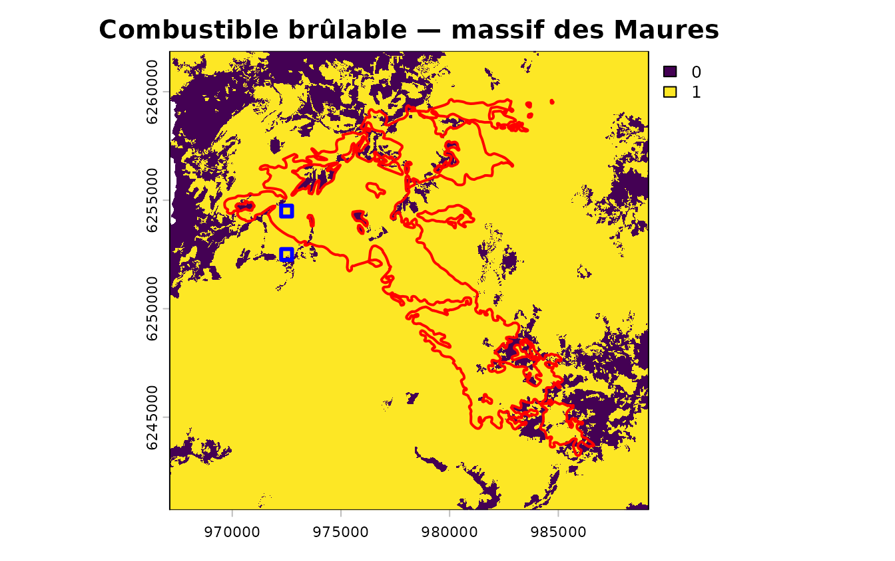
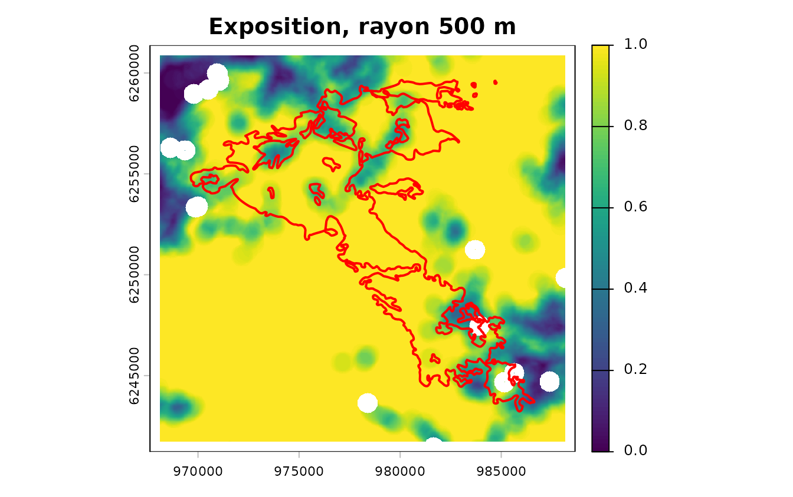
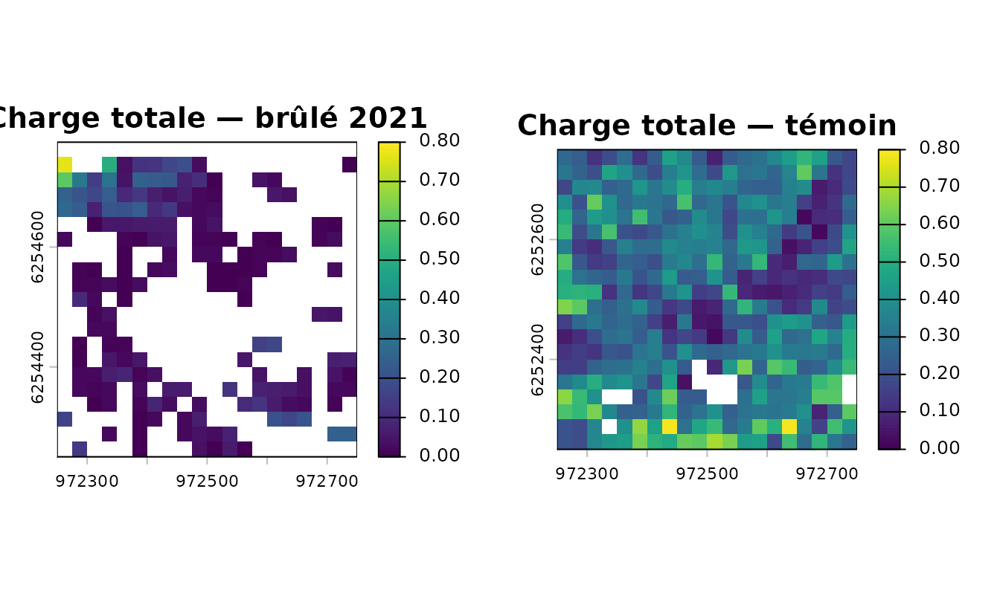
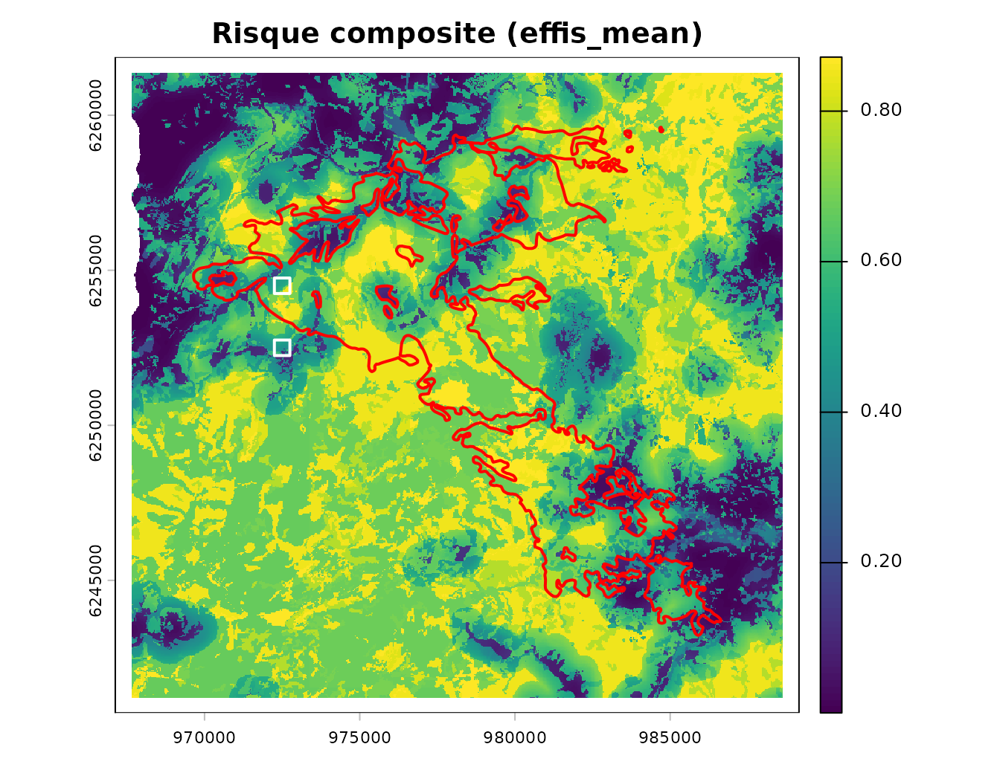
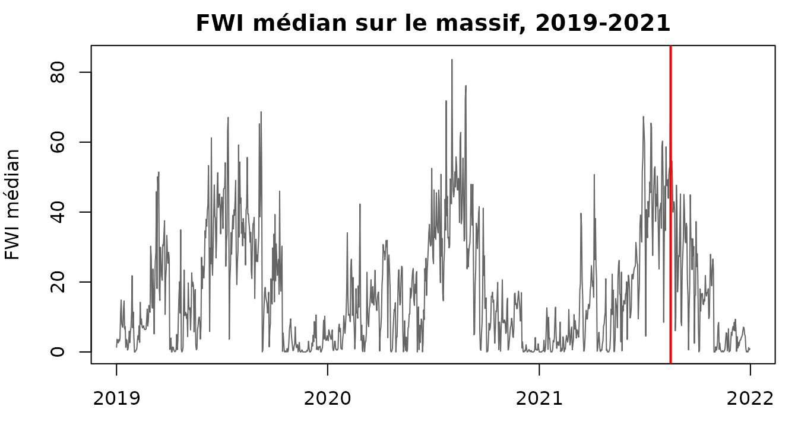

# Les Maures : le LiDAR voit le sous-étage que la BD Forêt ignore

``` r

library(firexpovulnR)
library(terra)
library(sf)
```

L’article
[Couchey](https://pobsteta.github.io/firexpovulnR/articles/couchey.md)
fait tourner la chaîne là où le package est le moins à son aise :
chênaie bourguignonne, vignes, **aucune couverture LiDAR**, et une
validation qui échoue honnêtement. Celui-ci la fait tourner là où il a
été conçu pour travailler — le **massif des Maures** — et montre les
deux choses que Couchey ne pouvait pas montrer.

D’abord un vrai échantillon de feux, dont celui du **Cannet-des-Maures
du 16 août 2021, 6 510 hectares**. Ensuite, et c’est l’objet de la page,
du LiDAR HD sur toute l’emprise, ce qui rend enfin mesurable le
**sous-étage** — l’angle mort que les deux vignettes désignent comme la
faiblesse méthodologique numéro un de tout l’édifice.

## Les données

``` r

gpkg <- system.file("extdata", "maures.gpkg", package = "firexpovulnR")
st_layers(gpkg)$name
#> [1] "study_area"           "bdforet_v2"           "clc_2018"            
#> [4] "burnt_areas"          "lidar_coverage"       "lidar_squares"       
#> [7] "millesime_candidates"

study   <- st_read(gpkg, "study_area", quiet = TRUE)
bdforet <- st_read(gpkg, "bdforet_v2", quiet = TRUE)
corine  <- st_read(gpkg, "clc_2018", quiet = TRUE)
feux    <- st_read(gpkg, "burnt_areas", quiet = TRUE)
lidar_cov <- st_read(gpkg, "lidar_coverage", quiet = TRUE)
carres  <- st_read(gpkg, "lidar_squares", quiet = TRUE)
```

``` r

c(km2 = round(as.numeric(st_area(study)) / 1e6),
  bdforet = nrow(bdforet), corine = nrow(corine),
  feux = nrow(feux), ha_brules = round(sum(feux$area_ha)))
#>       km2   bdforet    corine      feux ha_brules 
#>       423      2333       201        11      6927
```

Constitué le 2026-08-17 par `data-raw/build_maures_extract.R`. L’emprise
est cadrée sur le feu de 2021 tamponné de 2 km, ce qui donne un
échantillon de feux plutôt qu’un rectangle arbitraire.

### Le combustible méditerranéen, enfin

``` r

sort(table(bdforet$code_tfv), decreasing = TRUE)[1:6]
#> 
#>       LA4       FO1      FF31 FF2-51-51      FF32 FF1G06-06 
#>       359       349       275       210       207       170
```

`LA4` en tête — la **lande**, c’est-à-dire maquis et garrigue. Puis
forêt ouverte de feuillus, mélanges, **pin maritime** (`FF2-51-51`),
**chêne vert** (`FF1G06-06`). À Couchey la classe dominante était le
mélange de feuillus de plaine et il n’y avait pas une seule lande.

C’est ici que les valeurs par défaut du package sont le plus près de
leur base de preuves : le maquis reçoit le poids 1,00, le conifère fermé
0,95, et les rayons d’exposition ont au moins une validation
méditerranéenne derrière eux.

``` r

mil <- st_drop_geometry(st_read(gpkg, "millesime_candidates", quiet = TRUE))
mil[, c("dep", "year", "pct_area")]
#>   dep year pct_area
#> 1  83 2008     48.4
#> 2  83 2014     51.6

emprise <- st_buffer(study, 500)          # le rayon d'exposition, en marge

primaire <- fev_fuel_source(bdforet, type = "bdforet_v2", res = 25,
                            aoi = emprise, millesime = min(mil$year))
auxiliaire <- fev_fuel_source(corine, type = "clc_2018", res = 25,
                              aoi = emprise, millesime = 2018)
fuel <- fev_fuel_merge(primaire, auxiliaire)
#> "clc_2018" filled 157181 cells (21.1%) that
#> "bdforet_v2" left unmapped.
fuel <- fev_fuel_fill_gaps(fuel)
#> 3256 empty cells in 57 gaps.
#> ✔ 1592 filled: below 25 ha, so no component could have mapped them.
#> ℹ Largest gap: 64.31 ha.
#> ℹ Class from the modal 3x3 neighbour; the source layer records them as
#>   "gap_filled" rather than claiming a dataset mapped them.
#> Warning: 2 gaps left empty, above 25 ha.
#> ℹ Largest 64.31 ha -- a hole that size may be a real gap in the source, not a
#>   grid artefact.
#> ℹ `fev_exposure()` propagates each one across its whole window.
```

La seconde ligne répare 18 cellules non cartographiées — des esquilles
de rastérisation sur les liserés entre polygones CORINE. C’est expliqué
en détail dans l’[article
Couchey](https://pobsteta.github.io/firexpovulnR/articles/couchey.md) ;
l’essentiel est que
[`fev_exposure()`](https://pobsteta.github.io/firexpovulnR/reference/fev_exposure.md)
propage tout vide à travers sa fenêtre, donc une cellule isolée en
efface un disque de 500 m de rayon.

Le combustible est construit sur l’emprise **tamponnée de 500 m**, pas
sur l’emprise d’étude. Une fenêtre focale de 500 m de rayon a besoin de
sol au-delà du bord de ce qu’elle décrit ; sans cette marge, l’anneau
déborde dans le vide et la carte revient bordée de blanc. On calcule
donc sur plus grand qu’on ne publie, et on recadre après — voir la
section exposition.

Deux campagnes BD ORTHO, **2008 et 2014**. Retenez ce chiffre : le grand
feu est de 2021.

``` r

brulable <- fev_fuel_binary(fuel)
round(100 * terra::global(fev_data(brulable), "mean", na.rm = TRUE)[[1]], 1)
#> [1] 84
```

``` r

par(mar = c(2, 2, 2, 4))
plot(fev_data(brulable), main = "Combustible brûlable — massif des Maures")
plot(st_geometry(feux), add = TRUE, border = "red", lwd = 2)
plot(st_geometry(carres), add = TRUE, border = "blue", lwd = 3)
```



Traits rouges, les onze incendies. Carrés bleus, les deux emplacements
dont il sera question en section 4.

## Exposition

``` r

expo <- fev_exposure(brulable, radius = 500, type = "ember",
                     trim = study, quiet = TRUE)
terra::global(fev_data(expo), c("mean", "max"), na.rm = TRUE)
#>               mean max
#> exposure 0.8538179   1
```

``` r

par(mar = c(2, 2, 2, 4))
plot(fev_data(expo), main = "Exposition, rayon 500 m")
plot(st_geometry(feux), add = TRUE, border = "red", lwd = 2)
```



## LiDAR HD : couvert, contrairement à Couchey

``` r

st_drop_geometry(lidar_cov)
#>   n_tiles chantiers  timestamp
#> 1     505  106, 117 2025-05-01
round(100 * as.numeric(st_area(lidar_cov)) / as.numeric(st_area(study)), 1)
#> [1] 119.5
```

**505 dalles, deux blocs d’acquisition, survol de 2025.** Le contrôle de
disponibilité que le brief impose avant tout téléchargement répond ici
oui, là où il répondait non sur Couchey :

``` r

fev_lidarhd_available(study)
#> 505 LiDAR HD points tiles found.
#> i They cover 100% of the area.
#> i 2 acquisition blocks: "106", "117".
#> i 1 vintage: "2025".
```

Les dalles font 1 km de côté, en COPC — lisible par plage HTTP, donc
sans téléchargement quand quelques hectares suffisent. Mesuré : entre
120 et 260 Mo la dalle, pas le gigaoctet qu’une première rédaction
annonçait.

## La démonstration : deux endroits que la BD Forêt ne distingue pas

C’est le cœur de cette page. Deux carrés de 500 m, l’un **dans** le
périmètre brûlé de 2021, l’autre 2 km plus loin **hors** du feu, choisis
pour que la BD Forêt leur donne **la même classe**.

``` r

st_drop_geometry(carres)[, c("role", "tfv_dominant", "pulses_per_m2",
                             "points_per_m2")]
#>      role tfv_dominant pulses_per_m2 points_per_m2
#> 1   burnt    FF1-00-00         24.28         25.77
#> 2 control    FF1-00-00         25.59         31.87
```

Même classe dominante — `FF1-00-00`, forêt fermée à mélange de feuillus.
Donc, pour tout ce que la couche catégorielle sait exprimer, ces deux
endroits sont identiques :

``` r

lk <- fev_fuel_lookup("bdforet_v2")
w <- fev_fuel_weights(quiet = TRUE)
ligne <- lk[lk$code == "FF1-00-00", c("code", "label", "fuel_type", "burnable")]
ligne
#>        code                              label        fuel_type burnable
#> 9 FF1-00-00 Forêt fermée à mélange de feuillus broadleaf_closed     TRUE
w[[ligne$fuel_type]]
#> [1] 0.6
```

Même code, même type de combustible, même poids de disponibilité, même
valeur dans le masque brûlable. Un pare-feu placé sur cette carte les
traiterait de la même façon.

Voici ce que le LiDAR mesure :

``` r

brule <- rast(system.file("extdata", "lidar_burnt.tif",
                          package = "firexpovulnR"))
temoin <- rast(system.file("extdata", "lidar_control.tif",
                           package = "firexpovulnR"))

vb <- terra::global(brule, "mean", na.rm = TRUE)[, 1]
vt <- terra::global(temoin, "mean", na.rm = TRUE)[, 1]
data.frame(
  metrique = names(brule),
  brule = round(vb, 3),
  temoin = round(vt, 3),
  rapport = round(ifelse(vb > 0, vt / vb, NA), 1)
)
#>    metrique brule temoin rapport
#> 1    Height 9.723 10.142     1.0
#> 2       CBH 0.849  1.575     1.9
#> 3       FSG 0.766  1.102     1.4
#> 4    H_Bush 0.863  4.440     5.1
#> 5   CBD_max 0.034  0.155     4.5
#> 6       CFL 0.076  0.283     3.7
#> 7       TFL 0.081  0.312     3.8
#> 8       MFL 0.051  0.227     4.5
#> 9    FL_0_1 0.032  0.147     4.5
#> 10   FL_1_3 0.015  0.103     6.7
#> 11     GSFL 0.011  0.023     2.1
#> 12    Cover 0.102  0.297     2.9
#> 13  PAI_tot 0.424  1.640     3.9
```

Lisez la colonne `rapport` de haut en bas. **`Height` vaut 1,0** : les
deux endroits ont la même hauteur de canopée, 9,7 et 10,1 m. Un modèle
numérique de hauteur, un CHM, dirait donc lui aussi qu’ils se
ressemblent.

Puis tout le reste s’écarte, et ce qui s’écarte le plus est ce qui est
bas :

| Métrique  | Ce que c’est                  | Rapport |
|-----------|-------------------------------|---------|
| `FL_1_3`  | charge entre 1 et 3 m         | **6,7** |
| `H_Bush`  | sommet de la strate arbustive | **5,1** |
| `MFL`     | charge de sous-étage          | **4,5** |
| `FL_0_1`  | charge sous 1 m               | **4,5** |
| `CBD_max` | densité apparente maximale    | **4,5** |
| `TFL`     | **charge totale**             | **3,8** |

La charge de combustible totale passe de **0,081 à 0,312 kg/m²**. Quatre
ans après le feu, le carré brûlé a reconstitué une canopée de hauteur
comparable mais ne porte encore qu’un quart du combustible, et l’écart
est concentré dans la strate basse — celle où un feu de surface se
propage.

``` r

par(mfrow = c(1, 2), mar = c(2, 2, 3, 4))
plot(brule[["TFL"]], main = "Charge totale — brûlé 2021",
     range = c(0, 0.8))
plot(temoin[["TFL"]], main = "Charge totale — témoin",
     range = c(0, 0.8))
```



### Pourquoi la couche catégorielle ne pouvait pas le savoir

Trois raisons qui se cumulent, et aucune n’est un défaut de la BD Forêt.

**Son millésime est 2008 ou 2014**, et le feu est de 2021. Dans le carré
brûlé, elle décrit le peuplement d’avant.

**Sa nomenclature ne contient pas le sous-étage.** Même à jour,
`FF1-00-00` resterait `FF1-00-00` : le poste décrit la strate arborée et
l’essence dominante, pas ce qui pousse dessous.

**Et la hauteur de canopée n’aurait pas suffi.** C’est le résultat le
plus utile de cette comparaison : `Height` est identique. Un CHM issu
d’ortho ou de satellite — la solution qu’on propose souvent pour
rafraîchir un inventaire — aurait conclu que ces deux endroits se
valent.

### Mettre un chiffre dessus

L’argument tient sur deux carrés.
[`fev_fuel_profile()`](https://pobsteta.github.io/firexpovulnR/reference/fev_fuel_profile.md)
le généralise : il confronte chaque classe de la couche catégorielle aux
métriques que le LiDAR a mesurées, et rapporte la part de variance que
l’appartenance de classe explique.

``` r

lidar_deux <- merge(brule, temoin)
zone <- st_union(st_buffer(carres, 25))

p_prim <- fev_fuel_source(bdforet, type = "bdforet_v2", res = 25,
                          aoi = zone, millesime = min(mil$year))
p_aux  <- fev_fuel_source(corine, type = "clc_2018", res = 25,
                          aoi = zone, millesime = 2018)
profil <- fev_fuel_profile(fev_fuel_merge(p_prim, p_aux), lidar_deux,
                           quiet = TRUE)
#> "clc_2018" filled 100 cells (4.2%) that
#> "bdforet_v2" left unmapped.
profil$explained
#>    metric   n n_classes  explained
#> 1  H_Bush 566         9 0.17459515
#> 2  FL_0_1 566         9 0.16503238
#> 3  FL_1_3 566         9 0.08356245
#> 4   Cover 566         9 0.42623555
#> 5 PAI_tot 566         9 0.14757963
```

Le résultat est l’argument de cette page, réduit à cinq nombres :

| Métrique  | Ce qu’elle décrit              | Variance expliquée |
|-----------|--------------------------------|--------------------|
| `Cover`   | couvert de houppier            | **42,6 %**         |
| `H_Bush`  | hauteur de la strate arbustive | 17,5 %             |
| `FL_0_1`  | charge sous 1 m                | 16,5 %             |
| `PAI_tot` | indice de surface végétale     | 14,8 %             |
| `FL_1_3`  | **charge 1-3 m**               | **8,4 %**          |

La classification restitue **ce que ses sources enregistrent** — le
couvert de houppier, à 42,6 % — et laisse la charge de la strate 1-3 m
indéterminée à **92 %**. Or c’est cette strate-là qui porte le feu de
surface.

Ce n’est pas une critique de la BD Forêt : elle fait ce pour quoi elle
est faite. C’est la mesure du prix à payer quand on s’en sert seule pour
du combustible, et la raison pour laquelle le registre continu existe.

Neuf classes, 566 cellules, deux placettes d’un seul massif : un ordre
de grandeur et une méthode, pas une validation générale.

### Laquelle des trois sources en sait le plus ?

La question précédente portait sur une couche fusionnée. On peut la
poser à chaque source séparément, sur les mêmes cellules et contre le
même LiDAR — et c’est le seul moyen de trancher autrement qu’à l’estime
laquelle doit décider la classe.

ESA WorldCover s’ajoute ici aux deux sources de l’article. Contrairement
à la BD Forêt et à CORINE, elle se récupère sans compte, en lisant à
distance la seule fenêtre utile :

``` r

wc <- fev_fetch_worldcover(zone, year = 2021)
source_wc <- fev_fuel_source(wc, type = "worldcover_2021", res = 25, aoi = zone)
fev_fuel_profile(source_wc, lidar_deux, quiet = TRUE)$explained
```

Le chunk n’est pas exécuté à la compilation : une vignette ne doit pas
dépendre d’un service distant. Voici les trois profils, mesurés le
2026-08-18, **tous à 25 m** pour que la résolution ne fausse pas la
comparaison :

| Source | classes | `H_Bush` | `FL_0_1` | `FL_1_3` | `Cover` | `PAI_tot` |
|----|----|----|----|----|----|----|
| **BD Forêt v2** | 6 | **18,2 %** | **15,0 %** | **8,2 %** | **43,0 %** | **15,1 %** |
| CORINE 2018 | 3 | 8,8 % | 4,7 % | 0,6 % | 25,0 % | 5,3 % |
| ESA WorldCover 2021 | 5 | 4,0 % | 8,4 % | 5,2 % | 7,8 % | 8,2 % |

**La BD Forêt gagne sur les cinq métriques**, et elle est pourtant la
plus ancienne des trois — millésime 2014, antérieur au feu de 2021. La
récence n’explique donc pas l’écart : la profondeur thématique le fait.
L’essence et le taux de couvert sont une information réelle sur la
structure ; une classe unique « couvert arboré » n’en est pas une.

Ce que cette mesure ne dit pas, et qu’il faut garder en tête : elle
**neutralise volontairement la résolution**, en plaçant tout le monde à
25 m. Or c’est précisément ce que WorldCover apporte — 10 m, et un
millésime 2021 partout plutôt que 2008-2018 sur la seule France.
L’arbitrage se joue entre profondeur thématique d’un côté, finesse et
fraîcheur de l’autre ; il est désormais chiffré au lieu d’être discuté.

Deux placettes d’un seul massif, 566 cellules, et des nomenclatures à 6,
3 et 5 classes — un compte de classes plus élevé explique mécaniquement
un peu plus de variance. Six contre cinq ne rend pas compte d’un facteur
quatre.

## Quarante-huit fenêtres à travers le massif, et ce qu’elles disent des sources

Tout ce qui précède repose sur **deux placettes**. Deux, c’est assez
pour montrer qu’un écart existe ; ce n’est pas assez pour dire ce qu’il
vaut ailleurs. La campagne décrite ici porte la même question sur
quarante-huit fenêtres réparties sur tout le massif — et la réponse
n’est pas celle que les premières versions de cet article annonçaient.

### Comment les fenêtres ont été choisies

[`fev_lidar_batch()`](https://pobsteta.github.io/firexpovulnR/reference/fev_lidar_batch.md)
inverse les dalles une à une, avec reprise, et découpe dans chacune un
carré centré de 250 m — une dalle entière prend des heures, huit
fenêtres échantillonnent huit contextes pour une fraction du coût.

``` r

fev_lidar_batch(zone, "out/lidar", window = 250, max_tiles = 8, fires = feux)
```

Deux précautions décident de ce que vaut l’échantillon, et aucune n’est
cosmétique.

**L’ordre.** L’index des dalles est en ordre spatial. Prendre les huit
premières donne huit voisines dans un coin du massif : un seul contexte
échantillonné huit fois. Le défaut `spread = TRUE` parcourt les dalles
par traversée du plus éloigné. Sur les Maures, l’écart minimal entre
huit dalles passe de 1,0 à 10,0 km. La traversée est déterministe, donc
une reprise poursuit la répartition.

**L’emprise.** L’index retient toute dalle qui *intersecte* la zone
d’étude. Un carré centré sur une telle dalle peut donc tomber
entièrement en dehors. C’est arrivé, et massivement : sur les
vingt-quatre premières fenêtres, **treize étaient hors de la zone
d’étude** — inversées au prix fort, indiscernables des autres dans le
manifeste. La fonction centre désormais le carré sur l’intersection
dalle × emprise rétrécie d’une demi-fenêtre, et 43 dalles des 505 sont
écartées pour cette raison, annoncées et non retirées en silence.

### La confrontation, cellule par cellule

Chaque cellule de 25 m reçoit sa classe BD Forêt par son centre, puis on
compare dans chaque classe ce que le LiDAR a mesuré. Quarante-huit
fenêtres, **4 645 cellules**, dont 21 % sans polygone BD Forêt.

``` r

cl <- terra::rasterize(terra::vect(bdforet), fuel_lidar[[1]], field = "code_tfv")
cells <- as.data.frame(c(fuel_lidar, cl), na.rm = TRUE)
```

Les onze classes présentes sur au moins 100 cellules, triées par la
hauteur de base des houppiers qu’elles portent :

| Code TFV | Essence | n | CBH méd. | FSG méd. | CBH 90ᵉ c. | % continu |
|----|----|----|----|----|----|----|
| FF2-81-81 | Pin autre | 123 | **7,5** | **3,0** | 10,5 | **26** |
| FO2 | Conifères (ouvert) | 114 | **6,5** | **4,0** | 9,2 | **46** |
| FF1G06-06 | Chênes sempervirents | 1083 | 0,0 | 0,0 | 5,3 | 86 |
| FO1 | Feuillus (ouvert) | 283 | 0,0 | 0,0 | 3,5 | 86 |
| *hors BD Forêt* | — | 955 | 0,0 | 0,0 | 3,5 | 77 |
| LA4 | Lande | 438 | 0,0 | 0,0 | 3,5 | 84 |
| FF1-00-00 | Feuillus | 908 | 0,0 | 0,0 | 0,0 | 92 |
| FF1-10-10 | Châtaignier | 208 | 0,0 | 0,0 | 0,0 | 98 |
| FF2-51-51 | Pin maritime | 116 | 0,0 | 0,0 | 0,0 | 95 |
| FF31 | Mixte | 112 | 0,0 | 0,0 | 0,0 | 94 |
| FF32 | Mixte | 129 | 0,0 | 0,0 | 0,0 | 91 |

**Neuf classes sur onze ont une hauteur de base des houppiers médiane de
zéro.** Sur l’ensemble des cellules forestières, **84 % ont un CBH
exactement nul** : les houppiers touchent le sol, et la discontinuité
qui arrêterait un feu de surface n’existe pas.

### Ce que la classe explique, et ce qu’elle n’explique pas

Il faut poser la question proprement, et les premières versions de cet
article ne le faisaient pas. Elles mélangeaient des jeux de classes
différents d’un échantillon à l’autre et comptaient *hors BD Forêt*
comme une classe — alors qu’elle est l’absence de classe, et qu’elle
sépare forêt et non-forêt, ce qui est facile. Les R² publiés étaient
gonflés par ce mélange.

Le test honnête est le contraste **entre deux classes**, à jeu constant.

**Entre essences, à structure comparable :**

| Contraste                            | n     | CBH       | FSG       | CBD   |
|--------------------------------------|-------|-----------|-----------|-------|
| Feuillus vs Chênes sempervirents     | 1 991 | **0,015** | **0,016** | 0,004 |
| Feuillus vs Châtaignier              | 1 116 | 0,003     | 0,008     | 0,013 |
| Pin maritime vs Chênes sempervirents | 1 199 | 0,003     | 0,008     | 0,000 |

**Zéro.** Pas « peu » : savoir qu’un peuplement est du chêne vert plutôt
que du feuillu divers ou du châtaignier ne dit **rien** de la hauteur de
base des houppiers ni de la continuité verticale. L’écart-type du CBH à
l’intérieur d’une classe égale l’écart-type total.

**Entre les deux classes qui séparent, et les autres :**

| Contraste                                   | n     | CBH   | FSG   | CBD   |
|---------------------------------------------|-------|-------|-------|-------|
| Pin maritime vs **Pin autre**               | 239   | 0,391 | 0,410 | 0,312 |
| Feuillus vs **FO2 conifères ouvert**        | 1 022 | 0,260 | 0,307 | 0,145 |
| FO1 feuillus ouvert vs **FO2**              | 397   | 0,304 | 0,340 | 0,281 |
| Chênes sempervirents vs FO1 feuillus ouvert | 1 366 | 0,005 | 0,006 | 0,034 |

C’est la dernière ligne qui interdit la lecture facile. On voudrait
conclure que la nomenclature porte la structure quand elle parle de
forme du peuplement et pas quand elle parle d’essence — mais **fermé
contre ouvert ne sépare rien chez les feuillus** (0,005), et **le pin
maritime, résineux, se comporte comme un feuillu** (CBH médian nul, 95 %
de cellules continues).

Ce qui sépare n’est donc ni l’essence ni l’ouverture, mais **deux codes
particuliers** — `FF2-81-81` et `FO2` — qui se trouvent décrire les
peuplements où les arbres s’élaguent naturellement par le bas. Le reste
de la nomenclature, sur ce massif, ne distingue rien de la verticale.

Sur les onze classes prises ensemble, le R² global reflète mécaniquement
ces deux codes-là :

| Métrique                          | BD Forêt v2 | ESA WorldCover |
|-----------------------------------|-------------|----------------|
| Couvert                           | 0,596       | 0,007          |
| CFL — charge de houppier          | 0,501       | 0,005          |
| Hauteur                           | 0,353       | 0,003          |
| **CBD max — densité apparente**   | **0,177**   | 0,004          |
| **CBH — base des houppiers**      | **0,163**   | 0,002          |
| **FSG — discontinuité verticale** | **0,137**   | 0,002          |

Et l’écart ne se comble pas à l’intérieur d’une classe : chez les chênes
sempervirents, **1 083 cellules d’un seul et même code**, la charge de
houppier va de **0 à 2,08 kg/m²**.

### Faut-il aller chercher ailleurs ?

WorldCover n’explique rien — de 0,002 à 0,007 sur les six métriques. Sur
ce massif elle classe **75 % des cellules en « couvert arboré »**, et
une nomenclature presque constante n’explique presque rien.

Elle ne rattrape pas non plus ce que la BD Forêt ne couvre pas. Les 955
cellules sans polygone sont réparties en cinq classes WorldCover, et le
LiDAR mesure la même chose dans toutes :

| Classe WorldCover | n   | Couvert | CFL  | Hauteur |
|-------------------|-----|---------|------|---------|
| Tree cover        | 614 | 0,08    | 0,09 | 7,5     |
| Shrubland         | 171 | 0,10    | 0,12 | 9,5     |
| Grassland         | 96  | 0,06    | 0,11 | 8,0     |
| Built-up          | 41  | 0,23    | 0,20 | 10,5    |
| Cropland          | 33  | 0,00    | 0,08 | 2,5     |

Un « couvert arboré » à 0,08 de couvert mesuré n’est pas du couvert
arboré.

La conclusion est donc l’inverse d’un appel à plus de sources
catégorielles. Ce qui manque n’est pas une étiquette plus fine — c’est
une **mesure**. Une classe dit ce qu’il y a ; elle ne dit pas à quelle
hauteur. Et c’est précisément ce que consomment les seuils de
\[fev_crown_fire()\] : le CBH décide si un feu de surface monte en cime,
la CBD s’il s’y maintient. Les déduire de la classe reviendrait à
travailler avec un R² de 0,16 ; les mesurer est la seule voie.

### Ce qu’il faut retenir de la portée

Quarante-huit fenêtres de 250 m font 3 km² sur un seul massif, une seule
campagne LiDAR (2025), et l’attribution de classe se fait au centre de
cellule. C’est une illustration chiffrée de la limite annoncée en tête
d’article, pas une validation, et elle vaut pour les Maures.

Le critère d’arrêt est écrit plutôt qu’appliqué en silence : la
décomposition est refaite toutes les huit dalles, et la campagne
continue tant que les R² bougent. Entre douze et quarante-huit fenêtres
ils n’ont pas cessé de descendre.

## Greffe sur le registre catégoriel

``` r

lidar_src <- fev_fuel_source(temoin, type = "custom", register = "continuous",
                             units = c(TFL = "kg/m2"))
#> Warning: `units` does not cover every continuous layer.
#> ℹ Missing for "Height", "CBH", "FSG", "H_Bush", "CBD_max", "CFL", "MFL",
#>   "FL_0_1", "FL_1_3", "GSFL", "Cover", and "PAI_tot". An unlabelled metric is
#>   not reproducible.
```

En pratique on emploierait
[`fev_fuel_lidar()`](https://pobsteta.github.io/firexpovulnR/reference/fev_fuel_lidar.md)
sur la dalle elle-même ; ici la sortie est relue depuis l’extrait, faute
d’embarquer 200 Mo de nuage de points.

``` r

fuel_lidar <- fev_fuel_lidar("LHD_FXX_0972_6253_PTS_LAMB93_IGN69.copc.laz",
                             res = 25, millesime = 2025)
complet <- fev_fuel_attach(fuel, fuel_lidar)
fev_fuel_registers(complet)
#> [1] "categorical" "continuous"
```

[`fev_fuel_attach()`](https://pobsteta.github.io/firexpovulnR/reference/fev_fuel_attach.md)
n’est pas
[`fev_fuel_merge()`](https://pobsteta.github.io/firexpovulnR/reference/fev_fuel_merge.md).
La fusion arbitre entre sources qui se disputent le même pixel ; le
LiDAR ne dispute rien, il apporte des grandeurs que ni CORINE ni la BD
Forêt ne portent. La fonction rapporte la part de cellules catégorielles
effectivement couverte, parce que le programme est en cours et que les
deux registres décrivent des sous-ensembles différents de la carte.

## Validation

``` r

d <- st_drop_geometry(feux)
d[order(-d$area_ha), c("fire_date", "area_ha", "COMMUNE", "PERCNA2K")][1:6, ]
#>    fire_date area_ha           COMMUNE           PERCNA2K
#> 1 2021-08-16    6510 Cannet-des-Maures 61.070134045748695
#> 4 2024-06-11     273          Vidauban   56.2797473123125
#> 2 2021-08-16     116     Garde-Freinet  0.906368344753725
#> 5 2024-06-12       8     Garde-Freinet                  0
#> 8 2024-06-11       7     Garde-Freinet                  0
#> 3 2021-08-17       5     Garde-Freinet  77.95814762665916
```

Onze incendies, dont le 6 510 ha de 2021 — un échantillon, cette fois,
là où Couchey n’en avait qu’un.

### La météo, réelle et sans jeton

Trois ans de FWI calculés sur l’archive Open-Meteo, qui re-sert ERA5
sans authentification. Aucune clé n’a été lue pour produire ce tableau.

``` r

meteo_tab <- read.csv(gzfile(system.file("extdata", "maures_weather.csv.gz",
                                         package = "firexpovulnR")))
jour <- meteo_tab[meteo_tab$yr == 2021 & meteo_tab$mon == 8 &
                    meteo_tab$day == 16, ]
round(sapply(jour[, c("temp", "rh", "ws", "prec")], mean), 1)
#> temp   rh   ws prec 
#> 35.1 22.3 23.6  0.0
```

Trente-cinq degrés, 22 % d’humidité relative, 24 km/h de vent et pas une
goutte sur les vingt-quatre heures précédentes, le jour où 6 510
hectares ont brûlé.

``` r

meteo <- fev_data(fev_fwi_from_weather(meteo_tab, index = "FWI",
                                       crs_work = 2154))
danger_pct <- fev_fwi_percentile(meteo, ref_period = c(2019, 2021))

# Le jour de l'incendie, pas la dernière couche de la série. Cet article a
# longtemps cartographié `nlyr(...)`, c'est-à-dire le 31 décembre 2021 : un jour
# d'hiver à FWI médian 0,9, présenté sous une page qui raconte le 16 août à 84,3.
jour_feu <- which(as.Date(terra::time(fev_data(danger_pct))) ==
                    as.Date("2021-08-16"))
dernier <- fev_data(danger_pct)[[jour_feu]]
dispo <- fev_fuel_availability(fuel, weights = fev_fuel_weights(quiet = TRUE))
pile <- fev_align(danger = dernier, disponibilite = fev_data(dispo),
                  exposition = fev_data(expo))
danger <- fev_danger_index(pile$danger, pile$disponibilite,
                           normalise = "percentile")
vuln <- fev_vuln_layer(pile$exposition, method = "percentile_rank",
                       name = "expo")
risque <- fev_risk(danger, vuln, normalise = "none")
```

``` r

par(mar = c(2, 2, 2, 4))
plot(fev_data(risque), main = "Risque composite (effis_mean)")
plot(st_geometry(feux), add = TRUE, border = "red", lwd = 2)
plot(st_geometry(carres), add = TRUE, border = "white", lwd = 2)
```



Le jaune est le maquis continu, les taches sombres les trouées — le
risque moyen y vaut **0,68 sur combustible brûlable contre 0,05 en
dehors, un facteur 13,7**. Les périmètres rouges sont les onze
incendies, les deux carrés blancs les placettes LiDAR.

Ces chiffres étaient 0,32 et 6,5 dans les versions précédentes de cet
article, et l’écart n’est pas une amélioration de méthode : **la carte
publiée était celle du 31 décembre 2021**. `dernier` prenait la dernière
couche de la série plutôt que le jour de l’incendie, et un jour d’hiver
à FWI médian 0,9 produisait une carte qui paraissait plausible parce que
la normalisation en percentile reclasse ce qu’on lui donne, si bas
soit-il. Rien ne le signalait : ni la carte, ni la provenance, qui
enregistrait fidèlement une date que personne ne regardait.

**Il n’y a plus de cadre blanc**, et c’est l’argument `trim = study` de
l’appel ci-dessus qui l’a supprimé. Le combustible ayant été construit
sur l’emprise tamponnée, chaque cellule publiée a un anneau complet
derrière elle ; la couronne de 500 m où la fenêtre débordait est
calculée — il le faut, pour que l’intérieur soit juste — puis coupée au
lieu d’être publiée. Mesuré sur cette emprise : 9,3 % de cellules vides
sans recadrage, 0,3 % avec.

Le remède apparent était `na_rm = TRUE`, et il fallait s’en garder : il
calcule chaque cellule de bord sur la portion d’anneau qui a des
données, ce qui sous-estime l’exposition d’environ 30 % — mesuré ici
0,32 contre 0,46 — et le fait **invisiblement**. Un trou blanc valait
mieux que ce chiffre-là ; une emprise tamponnée vaut mieux que les deux.

### Lequel des deux termes fait la carte ?

Un indice composite peut être dominé par une seule de ses composantes
sans que rien ne le montre : la carte reste plausible, les couleurs
restent contrastées. La question se tranche en corrélant le résultat à
chacun de ses termes.

``` r

vals <- function(x) as.numeric(terra::values(fev_data(x))[, 1])
D <- vals(danger); V <- vals(vuln); R <- vals(risque)
ok <- stats::complete.cases(cbind(D, V, R))
round(c(danger = stats::cor(R[ok], D[ok]),
        vulnerabilite = stats::cor(R[ok], V[ok]),
        sd_danger = stats::sd(D[ok])), 3)
#>        danger vulnerabilite     sd_danger 
#>         0.890         0.839         0.321
```

Les deux termes pèsent, et le danger un peu plus. **Ce n’était pas le
cas quand cet article cartographiait le 31 décembre** : le danger
corrélait alors 0,542 et la vulnérabilité 0,995. Autrement dit la carte
publiée était sa propre couche d’exposition, repeinte — et le diagnostic
qui l’aurait montré tient en trois lignes de code.

Quatre chaînes mesurées sur ce massif, toutes le 16 août 2021 :

| Chaîne | écart-type danger | cor(R, danger) | cor(R, vuln) |
|----|----|----|----|
| **percentile, celle de cet article** | 0,308 | **0,879** | 0,833 |
| FWI brut, `normalise = "minmax"` | 0,237 | 0,699 | 0,769 |
| FWI descendu en échelle, `minmax` | 0,249 | 0,801 | 0,827 |
| FWI descendu en échelle, percentile | 0,003 | 0,479 | 1,000 |

Deux enseignements, et le second n’était pas attendu.

**Le percentile n’aplatit pas le danger, il le structure.** Chaque
maille de la réanalyse a sa propre climatologie ; classer aujourd’hui
contre elle fait ressortir les endroits où ce jour-là est le plus
exceptionnel, et cette variation est de l’information sur le climat
local, pas un artefact.

**Descendre le FWI en échelle par le relief dégrade la chaîne au
percentile**, et la raison est structurelle : le gradient adiabatique
est une transformation **monotone** de la série d’une zone. Décaler
toute une série d’un même offset ne change presque pas le rang d’un jour
à l’intérieur d’elle-même. Chaque zone héritant d’une histoire
déterministe de sa maille parente, toutes classent le 16 août au même
rang, et le contraste spatial disparaît — l’écart-type tombe à 0,003.

La descente d’échelle sert donc la chaîne au FWI brut, où elle fait
passer la corrélation au danger de 0,699 à 0,801, et dessert celle au
percentile. Ce n’est pas un défaut de l’une ou de l’autre : ce sont deux
questions différentes. *« Où est-ce le pire aujourd’hui »* veut un FWI
brut descendu en échelle ; *« où aujourd’hui est-il le plus inhabituel
»* veut un percentile, et n’a rien à faire d’une correction monotone.

### Le relief, quand on veut la première question

Non exécuté ici — le modèle de terrain se télécharge, et une vignette ne
doit pas dépendre d’un service distant :

``` r

dem <- fev_fetch_dem(zone)
cv <- fev_curvature(fev_data(dem), length_scale = 500)
z <- fev_topo_zones(fev_data(dem), n_elev = 8, stations = meteo_tab)
w <- fev_downscale_weather(meteo_tab, z, wind = "curvature", curvature = cv,
                           rain = "fitted")
danger_fin <- fev_fwi_zonal(w, z, dates = as.Date("2021-08-16"))
```

Mesuré sur ce massif le 2026-08-19 : 77 zones — 12 mailles de réanalyse
croisées avec 8 bandes d’altitude —, le FWI passe de 17 à 77 valeurs
distinctes, et le rapport d’échelle que signale
[`fev_align()`](https://pobsteta.github.io/firexpovulnR/reference/fev_align.md)
tombe de **141 000 cellules fines par maille grossière à 1,05**.

Ce que la correction couvre, et ce qu’elle ne couvre pas :

- **température** — gradient adiabatique, 3,3 K entre la zone la plus
  basse (28 m) et la plus haute (538 m). Sur un massif culminant à 775
  m, c’est la mesure de ce qu’on peut espérer.
- **humidité** — en découle à point de rosée constant, jusqu’à 18 points
  d’écart.
- **vent** — pondération de courbure de MicroMet, multiplicateur 0,82 à
  1,16. Seule la moitié sans direction du schéma publié : son terme de
  pente exige une direction de vent que ce paquet ne récupère pas.
- **pluie** — `rain = "fitted"` a **refusé de corriger**. Sur 20 points
  couvrant 464 m de dénivelé, la régression donne R² = 0,087 et p = 0,21
  : la réanalyse ne résout aucun effet orographique à cette échelle, et
  un gradient ajusté là-dessus aurait été du bruit voyageant dans la
  provenance sous les apparences d’une mesure.

### Le jour de l’incendie sort premier de 1 096

C’est la vérification que Couchey ne pouvait pas offrir avec un seul
feu, et que ni l’une ni l’autre ne pouvait offrir avec une série
inventée :

``` r

med <- terra::global(meteo, stats::median, na.rm = TRUE)[, 1]
dates <- as.Date(terra::time(meteo))
data.frame(date = dates[order(-med)][1:3],
           fwi_median = round(sort(med, decreasing = TRUE)[1:3], 1))
#>         date fwi_median
#> 1 2021-08-16       84.3
#> 2 2020-08-03       83.6
#> 3 2020-08-27       76.1
```

**Le 16 août 2021 est le premier jour sur 1 096.** Aucune donnée de feu
n’entre dans le calcul : le FWI ne connaît que la température,
l’humidité, le vent et la pluie servis par la réanalyse.

``` r

par(mar = c(3, 4, 2, 1))
plot(dates, med, type = "l", col = "grey40", xlab = "", ylab = "FWI médian",
     main = "FWI médian sur le massif, 2019-2021")
abline(v = as.Date("2021-08-16"), col = "red", lwd = 2)
```



### Deux pièges mesurés en construisant ce tableau

Le premier est une question d’unité déguisée en question de temps. La
pluie n’est pas une observation de midi comme les trois autres variables
: le système canadien prend le **cumul des vingt-quatre heures** qui
précèdent. Lire la pluie de l’heure de midi jette 23 heures par jour, et
la conséquence est mesurable ici — 10 % de jours de pluie au lieu de 39
%, et un DC de 1 949 le 16 août au lieu de 619.

Le second est ce qui rend le premier difficile à voir. Le facteur de
durée du FWI sature :

``` r

fD <- function(bui) 1000 / (25 + 108.64 * exp(-0.023 * bui))
round(sapply(c(BUI_150 = 150, BUI_200 = 200, BUI_300 = 300, BUI_600 = 600), fD), 2)
#> BUI_150 BUI_200 BUI_300 BUI_600 
#>   35.15   38.33   39.83   40.00
```

L’asymptote est 40. Au-delà d’un BUI de 250 environ, le FWI est presque
aveugle à la sécheresse supplémentaire : un DC dérivé au double de sa
valeur physique **ne fait pas paraître le FWI faux**. Il faut regarder
le DC et le BUI directement, ce que `fev_fwi_from_weather(index = "DC")`
permet.

``` r

sapply(c("DMC", "DC", "BUI"), function(ix) {
  r <- fev_data(fev_fwi_from_weather(meteo_tab, index = ix, crs_work = 2154))
  round(median(terra::values(r[[which(dates == as.Date("2021-08-16"))]]),
               na.rm = TRUE))
})
#> Warning in cffdrs::fwi(weather, init = init_df, lat.adjust = lat_adjust, : Same
#> initial data were used for multiple weather stations
#> Warning in cffdrs::fwi(weather, init = init_df, lat.adjust = lat_adjust, : Same
#> initial data were used for multiple weather stations
#> Warning in cffdrs::fwi(weather, init = init_df, lat.adjust = lat_adjust, : Same
#> initial data were used for multiple weather stations
#> DMC  DC BUI 
#> 155 643 199
```

Un DC de l’ordre de 600 en août dans les Maures est une sécheresse
profonde et plausible. C’est ce qu’on veut lire : une valeur qu’on peut
confronter à la littérature, pas un nombre qui a seulement l’air grand.

``` r

val <- fev_validate(risque, feux, millesime = min(mil$year))
val$temporal$table
#>                        lag_years n_fires area_ha pct_area
#> 1 <= 0 (fire before the vintage)       0       0        0
#> 2                         1 to 5       0       0        0
#> 3                            > 5      11    6927      100
val$auc
#> [1] 0.5671173
```

``` r

val$classes[, c("class", "pct_of_area", "pct_of_burnt", "ratio")]
#>       class pct_of_area pct_of_burnt ratio
#> 1   0 - 0.2       14.59         4.29  0.29
#> 2 0.2 - 0.4        2.72         1.22  0.45
#> 3 0.4 - 0.6       18.31        23.70  1.29
#> 4 0.6 - 0.8       42.22        46.34  1.10
#> 5   0.8 - 1       22.16        24.45  1.10
```

Le biais temporel est le même qu’à Couchey, et pour la même raison : le
combustible est de 2008, les feux vont de 2017 à 2026. Onze incendies
valent mieux qu’un, mais ils ont tous brûlé au moins neuf ans après la
photographie aérienne qui fonde la couche — **100 % de la surface
brûlée**, comme le dit le tableau.

Et cette fois l’AUC est calculable, sur une météo réelle et un
échantillon de 109 000 cellules brûlées. Il vaut **0,53**. Les ratios
par classe le disent plus crûment : 0,93, 1,05, 1,00 — la carte ne
distingue pas ce qui a brûlé de ce qui n’a pas brûlé.

C’est le résultat, et il faut le lire pour ce qu’il est. Ce n’est pas un
échec de la météo, qui place le jour du feu premier sur 1 096. C’est ce
qui arrive quand on module un danger météorologique juste par une couche
de combustible qui a treize ans de retard sur l’événement : le terme
spatial du produit est faux là où il compte, et le terme temporel ne
peut pas le sauver. Les Maures, avec onze feux et une couverture LiDAR
complète, ne rattrapent pas Couchey sur ce point — elles le documentent
mieux.

## Ce que cette page ajoute à Couchey

|  | Couchey | Les Maures |
|----|----|----|
| Combustible dominant | mélange de feuillus, vignes | **maquis**, pin maritime, chêne vert |
| Poids par défaut | mal à l’aise (0,60) | proches de leur base de preuves |
| LiDAR HD | **0 dalle** | **505 dalles, 100 %** |
| Échantillon de feux | 1 feu, 26 ha | **11 feux, 6 927 ha** |
| Millésime | 2007 / 2010 / 2014 | 2008 / 2014 |
| Validation | impossible, et c’est le résultat | possible : **AUC 0,53**, soit le hasard |
| Jour du feu dans le FWI | 2e sur 960 jours | **1er sur 1 096 jours** |

Et une chose que ni l’une ni l’autre ne résout : le LiDAR HD est de
**2025**, la BD Forêt de 2008. Le registre continu et le registre
catégoriel d’un même objet `fev_fuel_source` peuvent donc décrire le
même sol à dix-sept ans d’écart. Le package les tient séparés et
journalise les deux millésimes plutôt que de les mélanger — c’est tout
ce qu’il peut faire, et c’est mieux que de laisser croire qu’il s’agit
d’une seule description.

Enfin, une réserve sur les chiffres de la section 4. Ils viennent de
deux carrés de 25 hectares. Ils illustrent un mécanisme — la strate
basse porte l’écart que la classe ne voit pas — ils ne mesurent pas
l’effet d’un incendie sur un massif. Pour cela il faudrait les 505
dalles, ce qui est un travail de calcul, pas de démonstration.
